# Spec-Driven Development (SDD) — Methodology

Every feature, refactor, or non-trivial bugfix in this repository starts with a **specification**. Code is the *consequence* of an approved spec, never the spec itself.

## Why SDD here

- This is a game with hundreds of inter-connected behaviors (10 phases, 10 bosses, power-ups, weather, audio, observability). Drift is the enemy.
- We work with multiple AI agents (Cursor, Claude Code, etc.). Without a shared spec, each agent re-derives intent and conflicts pile up.
- A short, well-formed spec is faster than rewriting the wrong code.

## The cycle

```mermaid
flowchart LR
    Idea[Idea or bug report]
    Spec[Spec draft]
    Review[Review with user]
    Approved[Spec approved]
    Impl[Implementation]
    Harness[Harness: validate.sh]
    PR[Pull Request]
    Done[Spec status -> Done]

    Idea --> Spec --> Review
    Review -- changes requested --> Spec
    Review -- approved --> Approved
    Approved --> Impl --> Harness
    Harness -- red --> Impl
    Harness -- green --> PR
    PR --> Done
```



## Spec anatomy

Use [`SPEC_TEMPLATE.md`](SPEC_TEMPLATE.md). Every spec has:

| Section | Purpose |
|---|---|
| **Status header** | `Draft` / `Approved` / `In Progress` / `Done` / `Superseded` |
| **1. Specification** | Problem, Goals, Non-Goals, measurable Success Criteria |
| **2. User Stories** | "As a … I want … so that …" — the *why* |
| **3. Requirements** | `REF-XX-FR-N` (functional) and `REF-XX-NFR-N` (non-functional) — the *what* |
| **4. Design** | Architecture decisions, TypeScript contracts, files to touch, mermaid where needed |
| **5. Acceptance Criteria** | `REF-XX-AC-N` in Given/When/Then format — testable |
| **6. Test Plan** | Mapping of AC → unit/component/E2E tests |
| **7. Risks / Rollback** | What can go wrong + how to back out |

## Identifier convention

- `REF-XX` is a zero-padded ordinal: `REF-01`, `REF-02`, …
- `REF-XX-FR-N` = Functional Requirement N of REF-XX.
- `REF-XX-NFR-N` = Non-Functional Requirement N.
- `REF-XX-AC-N` = Acceptance Criterion N.

These IDs are stable. They appear in commit messages, test names, and PR descriptions.

## Status lifecycle

```
Draft -> Approved -> In Progress -> Done
                         |
                         +-> Blocked -> In Progress
                         |
                         +-> Superseded (link to new spec)
```

A spec moves to `Approved` only after the user signs off. Implementation starts only on `Approved`.

## Existing specs

- [REF-01 — Performance Observability Panel](specs/REF-01-perf-observability.md)
- [REF-02 — Audio (SFX) with Howler.js](specs/REF-02-audio-howler.md)
- [REF-03 — Texture Atlas on Canvas 2D](specs/REF-03-texture-atlas.md) (Archived; superseded by REF-04)
- [REF-04 — Main-thread long-task elimination](specs/REF-04-main-thread-long-tasks.md)
- [REF-05 — Cumulative Layout Shift](specs/REF-05-cumulative-layout-shift.md)
- [REF-06 — Visual redesign: Neon Arcade](specs/REF-06-visual-redesign.md)
- [REF-07 — Light theme mode](specs/REF-07-theme-light-mode.md) (Done)

## When to write a new spec

- Diff > ~20 LOC.
- Touches more than one module (`src/components`, `src/hooks`, `src/workers`, `src/utils`).
- Adds a new dependency to `package.json`.
- Changes a load-bearing decision (open an ADR alongside it).

A bugfix smaller than that may go straight to PR with a short description, but tests are still required.

## What is NOT a spec

- A README. READMEs describe what *exists*; specs describe what *will exist* and how we will know it works.
- An ADR. ADRs record decisions (and trade-offs) with long-term consequence; specs record deliverables.
- A TODO. TODOs are ephemeral. Specs are versioned in git.

## Relationship with ADRs

| Spec | ADR |
|---|---|
| Deliverable-focused | Decision-focused |
| Has Acceptance Criteria | Has Consequences |
| Measured by tests | Measured by long-term outcomes |
| Time-bounded | Time-spanning |

Both live under `docs/`. A spec may *trigger* an ADR (e.g., REF-03 may eventually trigger an ADR adopting PixiJS). An ADR may *spawn* multiple specs.
