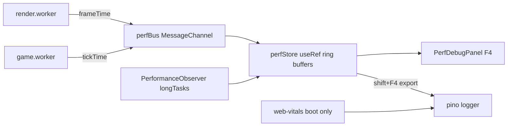

# REF-01 — Performance Observability Panel

| Field | Value |
|---|---|
| **Status** | Approved |
| **Owner** | rafael |
| **Created** | 2026-04-25 |
| **Last updated** | 2026-04-25 |
| **Related ADRs** | [ADR-0002](../../ADR/0002-keep-canvas2d-defer-pixijs.md) |
| **Supersedes** | — |

## 1. Specification

- **Problem**: today only `src/utils/performanceMetrics.ts` computes `frameTime/avgFrameTime/fps` in a circular buffer, but the data is never displayed in-app and is not correlated with phase/boss. There is no baseline to judge any future migration (PixiJS, atlas, audio).
- **Objective**: instrument and expose reliable performance metrics inside the game itself, with no perceptible FPS impact, producing a reproducible baseline per phase/boss/device.
- **Non-objective**: send telemetry to an external server, build an aggregated dashboard, or change game logic.
- **Success (measurable)**:
  - Debug overlay shows `fps`, `p1`, `p5`, `p50`, `frameTime`, `longTasks/min`, `heap MB` updating in ≤ 250 ms.
  - Total overhead < 0.3 ms/frame measured on a mid-tier mobile device.
  - JSON snapshot exportable via the F4 family of shortcuts.

## 2. User Stories

- **US-01** As a dev, I want to open a panel showing FPS/p1/p5 per phase to identify where the game drops frames.
- **US-02** As a dev, I want to export a session JSON snapshot to compare before/after an optimization.
- **US-03** As a dev, I want Web `long-animation-frames` logged via `pino` so I can reproduce jank outside the bug's window.

## 3. Requirements

### Functional

- **REF-01-FR-1** Extend `src/utils/performanceMetrics.ts` with streaming percentiles (`p1`, `p5`, `p50`, `p95`) — no per-frame `sort`.
- **REF-01-FR-2** Capture `PerformanceObserver` for `entryTypes: ['long-animation-frames', 'longtask']` and expose `longTasksPerMinute`.
- **REF-01-FR-3** Capture `web-vitals` (LCP/INP/CLS) **once at boot** in `src/main.tsx` and log via `createLogger(LogContext.PERFORMANCE)`.
- **REF-01-FR-4** New `PerfDebugPanel` component in `src/components/`, toggled by **F4** (matching the existing `useDebugControls.ts` pattern).
- **REF-01-FR-5** Snapshot export: **Shift+F4** triggers a `download(snapshot.json)` containing `metrics + phase + boss + ua + viewport + dpr`.

### Non-Functional

- **REF-01-NFR-1** Overhead < 0.3 ms/frame; `getMetrics()` remains O(1).
- **REF-01-NFR-2** Panel renders via `position: fixed`, outside the `GameBoard` tree, no re-render of the board (own `requestAnimationFrame` + `useRef`).
- **REF-01-NFR-3** Zero `any`. Public types exported from `src/types/`.
- **REF-01-NFR-4** Works in SSR-off (Vite SPA) and in workers via `MessageChannel` (worker → main reports actual render `frameTime`).

## 4. Design

### Architecture



### Contracts

```ts
export interface PerfFrameSample {
  source: 'render' | 'game' | 'main';
  ts: number;
  frameTimeMs: number;
}

export interface PerfSnapshot {
  fps: number;
  p1: number;
  p5: number;
  p50: number;
  p95: number;
  longTasksPerMinute: number;
  heapMB?: number;
  phaseId: number;
  bossId?: number;
  ua: string;
  viewport: { w: number; h: number; dpr: number };
  capturedAt: string;
}

export interface PerfBus {
  post(sample: PerfFrameSample): void;
  subscribe(handler: (sample: PerfFrameSample) => void): () => void;
}
```

### Files to touch

- `src/utils/performanceMetrics.ts` — add streaming percentiles (P² algorithm or 64-bucket histogram).
- `src/utils/perfBus.ts` (new) — `MessageChannel` shared between workers and main.
- `src/components/PerfDebugPanel.tsx` + `PerfDebugPanel.module.css` (new).
- `src/hooks/useDebugControls.ts` — register F4 / Shift+F4 shortcuts.
- `src/main.tsx` — bootstrap `web-vitals` + `PerformanceObserver`.
- `src/workers/render.worker.ts` and `src/workers/game.worker.ts` — post `frameTimeMs` to `perfBus`.
- `src/types/perf.ts` (new).
- `package.json` — `web-vitals@^4`.

## 5. Acceptance Criteria

- **REF-01-AC-1** Given the game running in development, when I press **F4**, then the panel appears in < 300 ms showing `fps/p1/p5/p50/frameTime/longTasks/heap`.
- **REF-01-AC-2** Given the panel open for 60 s on phase 9 (storm), when I press **Shift+F4**, then a `perf-snapshot-<timestamp>.json` file is downloaded containing every field of `PerfSnapshot`.
- **REF-01-AC-3** Given the game running without the panel, when I compare `avgFrameTime` against the prior version across 10 two-minute matches, then the average difference is < 0.3 ms.
- **REF-01-AC-4** Given a cold boot, when the game loads, then a `pino` log with `context=performance, event=web-vitals` is emitted with LCP/INP/CLS.
- **REF-01-AC-5** No `any` introduced (verified by `pnpm lint`).

## 6. Test Plan

| AC | Test type | Location |
|---|---|---|
| REF-01-AC-1 | component | `src/components/__tests__/PerfDebugPanel.test.tsx` |
| REF-01-AC-2 | component | `src/components/__tests__/PerfDebugPanel.snapshot.test.tsx` |
| REF-01-AC-3 | unit | `src/utils/__tests__/performanceMetrics.test.ts` (overhead microbench) |
| REF-01-AC-4 | unit | `src/test/__tests__/webVitalsBoot.test.ts` |
| REF-01-AC-5 | static | `pnpm lint` |

Plus full harness: `bash scripts/harness/validate.sh` green.

## 7. Risks / Rollback

- **R1** `PerformanceObserver` for `long-animation-frames` is not universal yet (Safari < 17). **Mitigation**: `try/catch` on creation + fallback to `longtask`.
- **R2** Access to `performance.memory` exists only in Chromium. **Mitigation**: optional field already in the interface.
- **Rollback**: the panel is isolated; removing the F4 shortcut in `useDebugControls.ts` and the `main.tsx` import neutralizes everything. The `web-vitals` dependency removed in a single line.
