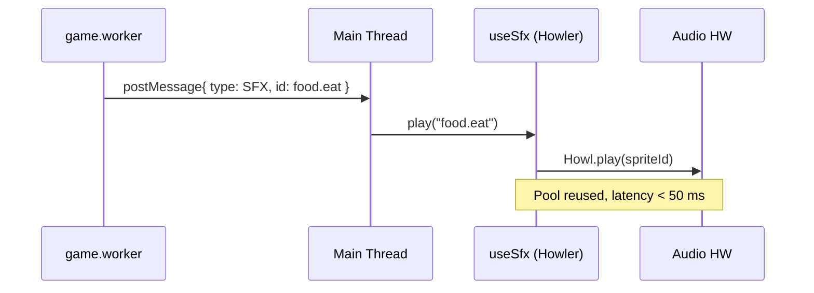

# REF-02 — Audio (SFX) with Howler.js

| Field | Value |
|---|---|
| **Status** | Approved |
| **Owner** | rafael |
| **Created** | 2026-04-25 |
| **Last updated** | 2026-04-25 |
| **Related ADRs** | — |
| **Supersedes** | — |

## 1. Specification

- **Problem**: the game has no audio. Sound feedback is the strongest "perceived quality" multiplier, with no FPS impact when done well (audio thread is separate from render).
- **Objective**: introduce SFX with latency < 50 ms, persisted volume/mute control, a single audio sprite (one download), and full compliance with browser autoplay policies.
- **Non-objective**: background music, spatial audio, generative audio, or synthesis (Tone.js stays out).
- **Success (measurable)**:
  - 100% of the key game actions emit SFX (list in FR-1).
  - Latency between logical event and play < 50 ms (measured via `performance.now()`).
  - 0 autoplay errors in console on Chrome / Safari / Firefox mobile.
  - Bundle delta ≤ 25 KB gzip (excluding audio asset itself).

## 2. User Stories

- **US-01** As a player, I want to hear distinct sounds for eating, taking damage, picking power-ups, shooting poison, and defeating bosses.
- **US-02** As a player, I want a persistent mute button (localStorage), respecting my preference across sessions.
- **US-03** As a player, I want sound to start only after my first interaction (autoplay rule).
- **US-04** As a dev, I want to fire SFX from `game.worker` without coupling the worker to the DOM.

## 3. Requirements

### Functional

- **REF-02-FR-1** Minimum SFX catalog:
  - `food.eat`, `food.timed.expire`, `damage.hit`, `damage.death`,
  - `powerup.collect`, `powerup.expire`,
  - `poison.shoot`, `poison.hit`,
  - `boss.spawn`, `boss.hit`, `boss.defeat`,
  - `phase.intro`, `phase.complete`,
  - `ui.click`, `ui.toggle`.
- **REF-02-FR-2** Everything packed into **one audio sprite** (`public/audio/sfx.mp3` + `.webm` fallback) with a JSON manifest produced by `scripts/build-audio-sprite.mjs` (parameterized and versioned if reusable; otherwise discarded after use per project rule on one-off scripts).
- **REF-02-FR-3** Hook `useSfx()` in `src/hooks/useSfx.ts` returning `play(id, opts?)`, `setMuted(bool)`, `isMuted`, `setVolume(0..1)`. Persistence via `localStorage` keys `snake.audio.muted`, `snake.audio.volume`.
- **REF-02-FR-4** Worker → main: `game.worker` posts `{ type: 'SFX', id }` messages already broadcast through `src/workers/game/gameBroadcast.ts`; main listens and calls `useSfx().play(id)`.
- **REF-02-FR-5** Autoplay policy: `Howler.ctx.resume()` on the first `pointerdown` / `keydown` / `touchstart`.
- **REF-02-FR-6** New `AudioToggle` component integrated into `GameHeader` or `StatusBar`.

### Non-Functional

- **REF-02-NFR-1** Zero `any`; `SfxId` is a discriminated literal union.
- **REF-02-NFR-2** Howler internal pool large enough for fast repeats (e.g., "eat 3× in 200 ms").
- **REF-02-NFR-3** Mobile-first; tested on iOS Safari and Android Chrome with bluetooth headphones.
- **REF-02-NFR-4** i18n: button label in PT-BR and EN-US (`src/i18n`).

## 4. Design

### Architecture



### Contracts

```ts
export type SfxId =
  | 'food.eat' | 'food.timed.expire'
  | 'damage.hit' | 'damage.death'
  | 'powerup.collect' | 'powerup.expire'
  | 'poison.shoot' | 'poison.hit'
  | 'boss.spawn' | 'boss.hit' | 'boss.defeat'
  | 'phase.intro' | 'phase.complete'
  | 'ui.click' | 'ui.toggle';

export interface SfxApi {
  play(id: SfxId, opts?: { rateJitter?: number; volume?: number }): void;
  setMuted(muted: boolean): void;
  setVolume(v: number): void;
  readonly isMuted: boolean;
  readonly volume: number;
}

export interface SfxWorkerMessage {
  type: 'SFX';
  id: SfxId;
}
```

### Files to touch

- `package.json` — `howler@^2.2`, `@types/howler` in devDependencies.
- `public/audio/sfx.mp3`, `sfx.webm`, `sfx.json` — assets, **not** generated by the agent; integrate only.
- `src/hooks/useSfx.ts` (new).
- `src/components/AudioToggle.tsx` + `.module.css` (new).
- `src/components/GameHeader.tsx` — slot for `AudioToggle`.
- `src/workers/game/gameBroadcast.ts` — emit `SfxWorkerMessage` on key events.
- `src/types/sfx.ts` (new).
- `src/i18n/*.json` — keys `audio.toggle.on/off`.

## 5. Acceptance Criteria

- **REF-02-AC-1** Given the game running, when I eat a food, then `food.eat` plays in < 50 ms from the collision (logged measurement).
- **REF-02-AC-2** Given audio muted and the player switches phase, when the app reloads, then audio remains muted (localStorage).
- **REF-02-AC-3** Given a cold boot in mobile Chrome, when there has been no interaction, then **no** sound plays and no autoplay error appears in the console.
- **REF-02-AC-4** Given 5 food collisions in 1 s, then all 5 play (pool works), with no clipped previous sound.
- **REF-02-AC-5** Bundle JS delta ≤ 25 KB gzip (measured by `pnpm build` before/after).
- **REF-02-AC-6** `pnpm lint` and `pnpm test` green; no `any`.

## 6. Test Plan

| AC | Test type | Location |
|---|---|---|
| REF-02-AC-1 | unit | `src/hooks/__tests__/useSfx.latency.test.ts` |
| REF-02-AC-2 | unit | `src/hooks/__tests__/useSfx.persistence.test.ts` |
| REF-02-AC-3 | component | `src/test/__tests__/audioAutoplay.test.ts` |
| REF-02-AC-4 | unit | `src/hooks/__tests__/useSfx.pool.test.ts` |
| REF-02-AC-5 | manual | bundle size diff in PR |
| REF-02-AC-6 | static | `pnpm lint` + `pnpm test --run` |

Plus full harness: `bash scripts/harness/validate.sh` green.

## 7. Risks / Rollback

- **R1** Different autoplay policies between Safari iOS and others. **Mitigation**: universal first-interaction gate (REF-02-FR-5).
- **R2** Background tab suspends `AudioContext`. **Mitigation**: `Howler.ctx.resume()` on `visibilitychange`.
- **R3** Audio sprite too large. **Mitigation**: target ≤ 200 KB (mp3 96 kbps mono); verify with `ffmpeg` before committing.
- **Rollback**: remove `useSfx` from `App.tsx`/`GameHeader`, drop `howler` from `package.json`. No gameplay state is affected.
