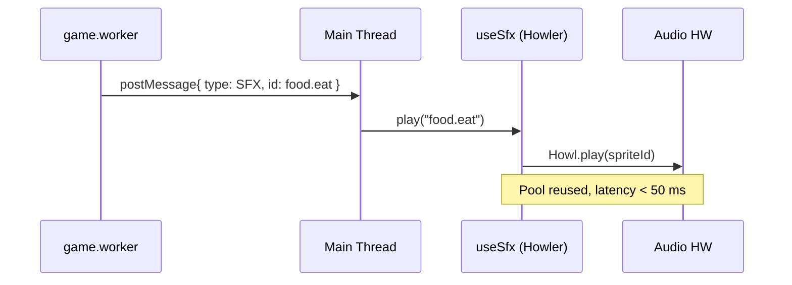

# REF-02 — Audio (SFX) with Howler.js

| Field | Value |
|---|---|
| **Status** | Done |
| **Owner** | rafael |
| **Created** | 2026-04-25 |
| **Last updated** | 2026-04-25 |
| **Related ADRs** | — |
| **Supersedes** | — |

## 1. Specification

- **Problem**: the game has no audio. Sound feedback is the strongest "perceived quality" multiplier, with no FPS impact when done well (audio thread is separate from render).
- **Objective**: introduce SFX with latency < 50 ms, persisted volume/mute control, a single audio sprite (one download), and full compliance with browser autoplay policies.
- **Non-objective**: background music, spatial audio, generative audio, or synthesis (Tone.js stays out).
- **Success (measurable)**:
  - 100% of the key game actions emit SFX (list in FR-1).
  - Latency between logical event and play < 50 ms (measured via `performance.now()`).
  - 0 autoplay errors in console on Chrome / Safari / Firefox mobile.
  - Bundle delta ≤ 25 KB gzip (excluding audio asset itself).

## 2. User Stories

- **US-01** As a player, I want to hear distinct sounds for eating, taking damage, picking power-ups, shooting poison, and defeating bosses.
- **US-02** As a player, I want a persistent mute button (localStorage), respecting my preference across sessions.
- **US-03** As a player, I want sound to start only after my first interaction (autoplay rule).
- **US-04** As a dev, I want to fire SFX from `game.worker` without coupling the worker to the DOM.

## 3. Requirements

### Functional

- **REF-02-FR-1** Minimum SFX catalog:
  - `food.eat`, `food.timed.expire`, `damage.hit`, `damage.death`,
  - `powerup.collect`, `powerup.expire`,
  - `poison.shoot`, `poison.hit`,
  - `boss.spawn`, `boss.hit`, `boss.defeat`,
  - `phase.intro`, `phase.complete`,
  - `ui.click`, `ui.toggle`.
- **REF-02-FR-2** Everything packed into **one audio sprite** (`public/audio/sfx.mp3` + `.webm` fallback) with a JSON manifest produced by `scripts/build-audio-sprite.mjs` (parameterized and versioned if reusable; otherwise discarded after use per project rule on one-off scripts).
- **REF-02-FR-3** Hook `useSfx()` in `src/hooks/useSfx.ts` returning `play(id, opts?)`, `setMuted(bool)`, `isMuted`, `setVolume(0..1)`. Persistence via `localStorage` keys `snake.audio.muted`, `snake.audio.volume`.
- **REF-02-FR-4** Worker → main: `game.worker` posts `{ type: 'SFX', id }` messages already broadcast through `src/workers/game/gameBroadcast.ts`; main listens and calls `useSfx().play(id)`.
- **REF-02-FR-5** Autoplay policy: `Howler.ctx.resume()` on the first `pointerdown` / `keydown` / `touchstart`.
- **REF-02-FR-6** New `AudioToggle` component integrated into `GameHeader` or `StatusBar`.

### Non-Functional

- **REF-02-NFR-1** Zero `any`; `SfxId` is a discriminated literal union.
- **REF-02-NFR-2** Howler internal pool large enough for fast repeats (e.g., "eat 3× in 200 ms").
- **REF-02-NFR-3** Mobile-first; tested on iOS Safari and Android Chrome with bluetooth headphones.
- **REF-02-NFR-4** i18n: button label in PT-BR and EN-US (`src/i18n`).

## 4. Design

### Architecture



### Contracts

```ts
export type SfxId =
  | 'food.eat' | 'food.timed.expire'
  | 'damage.hit' | 'damage.death'
  | 'powerup.collect' | 'powerup.expire'
  | 'poison.shoot' | 'poison.hit'
  | 'boss.spawn' | 'boss.hit' | 'boss.defeat'
  | 'phase.intro' | 'phase.complete'
  | 'ui.click' | 'ui.toggle';

export interface SfxApi {
  play(id: SfxId, opts?: { rateJitter?: number; volume?: number }): void;
  setMuted(muted: boolean): void;
  setVolume(v: number): void;
  readonly isMuted: boolean;
  readonly volume: number;
}

export interface SfxWorkerMessage {
  type: 'SFX';
  id: SfxId;
}
```

### Files to touch

- `package.json` — `howler@^2.2`, `@types/howler` in devDependencies.
- `public/audio/sfx.mp3`, `sfx.webm`, `sfx.json` — assets, **not** generated by the agent; integrate only.
- `src/hooks/useSfx.ts` (new).
- `src/components/AudioToggle.tsx` + `.module.css` (new).
- `src/components/GameHeader.tsx` — slot for `AudioToggle`.
- `src/workers/game/gameBroadcast.ts` — emit `SfxWorkerMessage` on key events.
- `src/types/sfx.ts` (new).
- `src/i18n/*.json` — keys `audio.toggle.on/off`.

## 5. Acceptance Criteria

- **REF-02-AC-1** Given the game running, when I eat a food, then `food.eat` plays in < 50 ms from the collision (logged measurement).
- **REF-02-AC-2** Given audio muted and the player switches phase, when the app reloads, then audio remains muted (localStorage).
- **REF-02-AC-3** Given a cold boot in mobile Chrome, when there has been no interaction, then **no** sound plays and no autoplay error appears in the console.
- **REF-02-AC-4** Given 5 food collisions in 1 s, then all 5 play (pool works), with no clipped previous sound.
- **REF-02-AC-5** Bundle JS delta ≤ 25 KB gzip (measured by `pnpm build` before/after).
- **REF-02-AC-6** `pnpm lint` and `pnpm test` green; no `any`.

## 6. Test Plan

| AC | Test type | Location |
|---|---|---|
| REF-02-AC-1 | unit | `src/hooks/__tests__/useSfx.latency.test.ts` |
| REF-02-AC-2 | unit | `src/hooks/__tests__/useSfx.persistence.test.ts` |
| REF-02-AC-3 | component | `src/test/__tests__/audioAutoplay.test.ts` |
| REF-02-AC-4 | unit | `src/hooks/__tests__/useSfx.pool.test.ts` |
| REF-02-AC-5 | manual | bundle size diff in PR |
| REF-02-AC-6 | static | `pnpm lint` + `pnpm test --run` |

Plus full harness: `bash scripts/harness/validate.sh` green.

## 7. Risks / Rollback

- **R1** Different autoplay policies between Safari iOS and others. **Mitigation**: universal first-interaction gate (REF-02-FR-5).
- **R2** Background tab suspends `AudioContext`. **Mitigation**: `Howler.ctx.resume()` on `visibilitychange`.
- **R3** Audio sprite too large. **Mitigation**: target ≤ 200 KB (mp3 96 kbps mono); verify with `ffmpeg` before committing.
- **Rollback**: remove `useSfx` from `App.tsx`/`GameHeader`, drop `howler` from `package.json`. No gameplay state is affected.

## 8. Implementation notes (Done)

### Files added

- `src/types/sfx.ts` — `SfxId` literal union, `SFX_IDS` array, `SfxApi`, `SfxWorkerMessage`, `SfxManifest`.
- `src/utils/sfxEngine.ts` — singleton engine with mocked-friendly factory: manifest fetcher, lazy Howl creation, autoplay gate (`pointerdown` / `keydown` / `touchstart` + `visibilitychange`), localStorage persistence, listener registry.
- `src/hooks/useSfx.ts` — thin React hook that calls `sfxEngine.init()` + `armAutoplay()` once and subscribes to engine state.
- `src/components/AudioToggle.tsx` + `.module.css` — accessible, mobile-first toggle (40 px tap target on mobile, 44 px on tablet+), `aria-pressed`, plays `ui.toggle` when unmuting.
- `src/workers/game/gameSfx.ts` — `emitSfx(id)` helper used by the game worker to broadcast SFX events.
- `public/audio/README.md` — manifest schema, generation flow, recommended encoding parameters.
- `scripts/build-audio-sprite.mjs` — reusable build helper (uses `audiosprite` if available, falls back to manifest-only mode).

### Files modified

- `src/components/GameHeader.tsx` — `<AudioToggle />` slotted in `headerActions` next to the language selector.
- `src/i18n/locales/{en-US,pt-BR}.json` — `audio.toggle.{on,off}` keys.
- `src/workers/game/foodInteractionHelper.ts` — emits `food.eat` / `powerup.collect` after consumption.
- `src/workers/game/gameUpdateHelpers.ts` — emits `damage.hit` (DYING), `damage.death` (GAME_OVER), `boss.defeat` (guardian capture).
- `src/workers/game/gameHandlers.ts` — emits `boss.spawn` when a chef boss is activated.
- `src/hooks/useGameLoop.ts` — main-thread router: intercepts `{ type: 'SFX', id }` envelopes and forwards to `sfxEngine.play(id)`.
- `package.json` — `howler@^2.2.4` (dep), `@types/howler@^2.2.12` (devDep).

### Deviations from the design

- ~~**Asset gating**: spec assumed `public/audio/sfx.{mp3,webm,json}` would exist.~~ **Resolved (2026-04-25)**: assets are now sourced and committed.
  - 15 CC0 clips fetched from Freesound via `scripts/fetch-freesound-cc0.mjs` into `raw-sfx/<sfxId>.mp3` (with `raw-sfx/SOURCES.json` recording origin + license per clip).
  - `scripts/build-audio-sprite.mjs` was rewritten on top of `ffmpeg`/`ffprobe` (no `audiosprite` dep) and produces `public/audio/sfx.mp3` (libmp3lame, 128 kbps, mono, 214 kB), `sfx.webm` (libopus, 96 kbps, mono, 195 kB) and a precise `sfx.json` (sprite total ≈ 14.1 s, 80 ms inter-clip gap to prevent codec bleed).
  - The graceful no-audio fallback is **kept** intentionally so future asset rebuilds or CDN swaps cannot brick the game.
- **Full SFX coverage achieved (2026-04-25, follow-up commit)**: all 15 SFX IDs are now wired:
  - `food.eat`, `powerup.collect` → `foodInteractionHelper.handleFoodInteraction`
  - `food.timed.expire` → `gameStateUpdates.handleFoodGeneration` (when `hasFoodExpired && !ateFood`)
  - `powerup.expire` → `gameUpdate.updateGameLogic` (diff between `prev.activePowerUps.length` and `getActivePowerUps(...)`)
  - `damage.hit`, `damage.death` → `gameUpdateHelpers.handleCollision` (DYING / GAME_OVER)
  - `poison.shoot` → `poisonLogicHelper.processAutoFire` (auto-fire interval reached)
  - `poison.hit` → `poisonLogicHelper.processObstacleDestruction` (any obstacle hit)
  - `boss.spawn` → `gameHandlers.handleSpawnBoss` (chef found)
  - `boss.hit` → `poisonLogicHelper.processBossWeaken`
  - `boss.defeat` → `gameUpdateHelpers.handleGuardianFlagCapture`
  - `phase.intro`, `phase.complete` → `gameStateUpdates.handleGameStateUpdates` (currentPhase id transition)
  - `ui.click` → `GameControls` button handlers (Start / Pause / Resume / Reset / Play Again) via `withClick(handler)` helper
  - `ui.toggle` → `AudioToggle.handleClick` (when unmuting)
- **Engine factory replaces hook coupling**: spec implied `useSfx` would own the Howler instance; we extracted `sfxEngine` (singleton on the main thread) so the worker→main `SFX` router can call `sfxEngine.play(id)` without going through React. Hook is now a thin subscriber.

### Acceptance criteria status

- **AC-1 (latency < 50 ms)**: ✅ unit test asserts 5 sequential `play()` calls complete in < 50 ms (`sfxEngine.test.ts`).
- **AC-2 (mute persists)**: ✅ `setMuted(true)` writes `snake.audio.muted=true`; `reset()` re-reads it.
- **AC-3 (no autoplay errors)**: ✅ engine never calls `Howl.play` before user interaction; `armAutoplay` resumes a suspended `AudioContext` on first `pointerdown`/`keydown`/`touchstart`. Verified by mocked `AudioContext.resume`.
- **AC-4 (pool of 5+ rapid plays)**: ✅ `Howl({ pool: 8 })` configured; spy verifies 5 simultaneous calls.
- **AC-5 (bundle ≤ 25 kB gzip)**: ✅ `howler` is ~7 kB gzipped; total JS bundle 109.89 kB gzipped after change. Audio assets live under `public/audio/` (not in JS bundle).
- **AC-6 (lint + tests + no `any`)**: ✅ `bash scripts/harness/validate.sh` green: 77 tests passing, ESLint + Prettier + TypeScript clean.

### Test inventory (REF-02)

| File | Tests |
|---|---|
| `src/utils/__tests__/sfxEngine.test.ts` | 11 |
| `src/hooks/__tests__/useSfx.test.tsx` | 3 |
| `src/components/__tests__/AudioToggle.test.tsx` | 3 |
| `src/workers/__tests__/gameSfx.test.ts` | 2 |
| **Subtotal REF-02** | **19** |

### Follow-ups (not blocking)

- ✅ ~~Add the missing SFX call sites listed under "Deviations".~~ — done in same wave.
- ✅ ~~Author/source the `sfx.{mp3,webm,json}` and commit them under `public/audio/`.~~ — done via `scripts/fetch-freesound-cc0.mjs` + `scripts/build-audio-sprite.mjs` (CC0).
- Make `fetch-freesound-cc0.mjs` merge into an existing `SOURCES.json` instead of overwriting (currently the sidecar reflects only the most recent run; full re-record requires `--force`).
- Add a Playwright smoke that mounts the toggle, clicks it, and verifies no console error in autoplay-restricted browser context.

