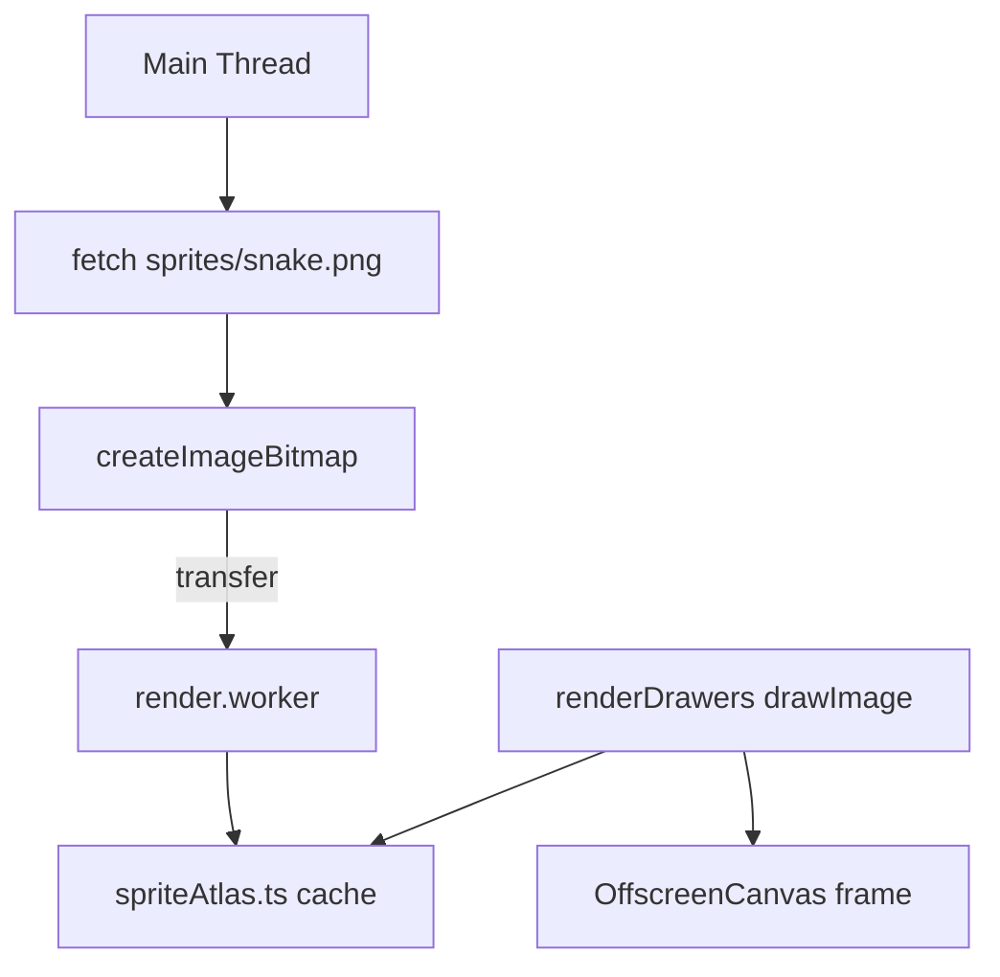

# REF-03 — Texture Atlas on Canvas 2D

| Field | Value |
|---|---|
| **Status** | Approved (conditional) |
| **Owner** | rafael |
| **Created** | 2026-04-25 |
| **Last updated** | 2026-04-25 |
| **Related ADRs** | [ADR-0002](../../ADR/0002-keep-canvas2d-defer-pixijs.md) |
| **Supersedes** | — |
| **Conditional gate** | Implementation begins only after REF-01 baseline shows `p5(frameTime) > 20 ms` in some real scenario. |

## 1. Specification

- **Problem**: every `drawObstacle/drawFood/drawPortal/drawSnakeBody` in `src/workers/render/renderDrawers.ts` uses primitives (`fillRect`, `arc`, `path`) and conditional shadows. On mobile with a dense grid this saturates the worker thread and forces gradient recreation each frame.
- **Objective**: introduce a **texture atlas** consumed by the render worker via `OffscreenCanvas` 2D `drawImage(sourceImageBitmap, sx, sy, sw, sh, dx, dy, dw, dh)`, **without** swapping engines. Pre-render variants (light/damage states) as static sprites.
- **Non-objective**: PixiJS, WebGL, WebGPU, Spine animations. Those belong to a future Wave 3 (after this validates the gain).
- **Success (measurable)**:
  - p5 of `frameTime` drops by ≥ 25 % on phase 9 (the heaviest scenario).
  - Number of paint calls per frame drops by ≥ 60 % (measured via temporary instrumentation).
  - Additional GPU/CPU memory < 8 MB.

## 2. User Stories

- **US-01** As a dev, I want to replace vector drawings with sprites from an atlas to cut paint cost.
- **US-02** As a dev, I want the atlas loaded **once** per session and reused by workers via `transferControlToOffscreen` / `ImageBitmap`.
- **US-03** As QA, I want the visual appearance indistinguishable to the naked eye from the current version (zero regression).

## 3. Requirements

### Functional

- **REF-03-FR-1** Generate atlas `public/sprites/snake.png` + `snake.json` (Pixi-/`free-tex-packer`-compatible format, **but consumed by our own loader**, no Pixi yet).
- **REF-03-FR-2** Loader `src/workers/render/spriteAtlas.ts` that receives an `ImageBitmap` via `postMessage` (transferable) and exposes `getFrame(name): {bitmap, sx, sy, sw, sh}`.
- **REF-03-FR-3** Replace, in order: `drawFood`, `drawObstacle`, `drawPortal`, `drawShot`. **Keep** `drawSnakeBody`/`drawSnakeHead` vectorial in this first pass (the snake uses continuous interpolation, costlier to adapt).
- **REF-03-FR-4** Remove `shadowBlur` on mobile (already partially removed per the README) and replace with sprites that have a pre-baked glow.
- **REF-03-FR-5** Cache `OffscreenCanvas` per variant (e.g., pulsing food in 8 pre-rendered frames) accessed by `frameIndex = floor(elapsed/period) % 8`.

### Non-Functional

- **REF-03-NFR-1** No public-signature change in `renderDrawers.ts` to minimize diff and ease review.
- **REF-03-NFR-2** Fallback: if `ImageBitmap` / atlas fails to load, keep current vectorial drawing (graceful degradation).
- **REF-03-NFR-3** Zero `any`; use `??` for defaults (project rule).
- **REF-03-NFR-4** Mobile-first: validate first on viewport ≤ 414 px.

## 4. Design

### Architecture



### Contracts

```ts
export interface SpriteFrame {
  bitmap: ImageBitmap;
  sx: number; sy: number;
  sw: number; sh: number;
  pivotX?: number; pivotY?: number;
}

export interface SpriteAtlas {
  ready: boolean;
  getFrame(name: SpriteName): SpriteFrame | null;
}

export type SpriteName =
  | 'food.normal' | 'food.timed'
  | 'obstacle.static' | 'obstacle.moving'
  | 'portal.a' | 'portal.b'
  | 'shot.poison';
```

### Files to touch

- `public/sprites/snake.png`, `snake.json` — assets, **not** generated by the agent; received from designer or external script.
- `src/workers/render/spriteAtlas.ts` (new).
- `src/workers/render/renderDrawers.ts` — refactor `drawFood/drawObstacle/drawPortal/drawShot`.
- `src/workers/render/renderState.ts` — add `atlas?: SpriteAtlas` field.
- `src/workers/render.worker.ts` — handler `LOAD_ATLAS`.
- Module in main thread: `fetch -> createImageBitmap -> postMessage` on `INIT`.
- `src/types/sprite.ts` (new).

## 5. Acceptance Criteria

- **REF-03-AC-1** Given the game on phase 9 for 60 s, when I compare `p5(frameTime)` against the REF-01 baseline, then the drop is ≥ 25 %.
- **REF-03-AC-2** Given the atlas unavailable (404), when the game starts, then it falls back to vectorial rendering without crash and logs a `warn` with `context=performance`.
- **REF-03-AC-3** Given the game on a mobile viewport (≤ 414 px), when I compare food/obstacle/portal/shot screenshots against the current version across 5 phases, then the visual delta is ≤ 2 % (pixelmatch or designer approval).
- **REF-03-AC-4** Additional memory reported by `performance.memory.usedJSHeapSize` (Chromium) grows by ≤ 8 MB after atlas load.
- **REF-03-AC-5** `pnpm test` green; no `any`; no `||` in new default-value assignments.

## 6. Test Plan

| AC | Test type | Location |
|---|---|---|
| REF-03-AC-1 | perf | `node scripts/harness/perf-baseline.mjs` over a fresh phase-9 snapshot |
| REF-03-AC-2 | unit | `src/workers/render/__tests__/spriteAtlas.fallback.test.ts` |
| REF-03-AC-3 | manual / smoke | `node scripts/harness/smoke-e2e.mjs` + manual visual review |
| REF-03-AC-4 | manual | inspect `performance.memory` in DevTools after load |
| REF-03-AC-5 | static | `pnpm lint` + `pnpm test --run` |

Plus full harness: `bash scripts/harness/validate.sh` green.

## 7. Risks / Rollback

- **R1** `createImageBitmap` fails in some older Safaris. **Mitigation**: fallback to `Image()` + `drawImage` directly; AC-2 covers the degraded path.
- **R2** Heavy atlas hurts LCP. **Mitigation**: cap < 256 KB gzip; preload via `<link rel="preload" as="image">`.
- **R3** Visible visual diff (sprite vs vectorial). **Mitigation**: AC-3 + designer review before merge.
- **Rollback**: feature flag `RENDER_USE_ATLAS` (`import.meta.env.VITE_RENDER_USE_ATLAS`) in `renderState.ts`. Disable in `.env` to revert without a deploy.
