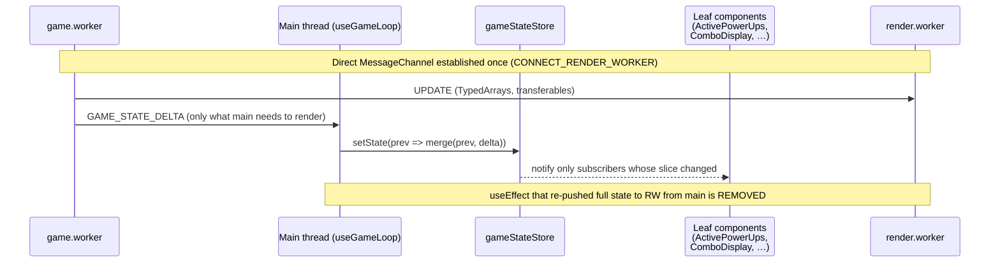

# REF-04 — Main-thread long-task elimination

| Field | Value |
|---|---|
| **Status** | Done |
| **Owner** | rafael |
| **Created** | 2026-04-25 |
| **Last updated** | 2026-04-25 |
| **Related ADRs** | [ADR-0002](../../ADR/0002-keep-canvas2d-defer-pixijs.md), [ADR-0004](../../ADR/0004-react-external-store-and-css-driven-background.md) |
| **Supersedes** | replaces archived [REF-03](./REF-03-texture-atlas.md) as the next perf workstream |

## 1. Specification

- **Problem**: the first perf baseline ([`scripts/harness/.artifacts/perf-baseline.json`](../../../scripts/harness/.artifacts/perf-baseline.json)) measured on iPhone Safari (iOS 18.5, 430×932@3) shows that the **render worker is already idle** (`p5(frameTime) = 0.20 ms`, `p95 = 0`, FPS counter saturating at thousands), but the **main thread reports `256 longTasksPerMinute`** (≈ 4.3 long tasks/s, ≥ 50 ms each). Long tasks block input, animation, and the SFX autoplay gate; they are the dominant tax on perceived smoothness on mobile despite a green render budget.
- **Objective**: reduce main-thread `longTasksPerMinute` by **≥ 60 %** (from 256 → ≤ 100) on the same device class without regressing render `frameTime` or rejecting any REF-02 SFX latency budget.
- **Non-objective**: rewriting React state into a global store, swapping renderer (already deferred by ADR-0002), or addressing GC pressure beyond what naturally falls out of removing the redundant pipeline.
- **Success (measurable)**:
  - `longTasksPerMinute` ≤ 100 in a fresh `perf-snapshot-*.json` captured on the same iPhone profile after the change.
  - `frameTime p95` stays ≤ 5 ms (it is currently `0`, i.e. far below that ceiling).
  - SFX latency unit test (`sfxEngine.latency`) still passes (5 plays in < 50 ms).
  - `pnpm build` JS bundle delta within ±2 kB gzip.

## 2. User Stories

- **US-01** As a player on mid-range mobile, I want the snake to respond to every tap without the UI freezing, so the game feels native.
- **US-02** As a player who just unmuted audio, I want the first SFX to play within one frame of the gameplay event, with no perceptible lag during heavy phases.
- **US-03** As a maintainer, I want a single source of truth for "what gets pushed to the render worker", so future bugs land in one file instead of two.

## 3. Requirements

### Functional

- **REF-04-FR-1** Remove the redundant render-worker dispatch from `src/components/GameBoard.tsx` (the `useEffect` block currently posting `{ type: 'UPDATE', payload: { snake, bossSnake, shots, food, obstacles, portals, activeBoss, guardianFlag, isEating, speed, status } }` to `renderWorkerRef.current`). The same payload — minus the legacy `isEating` flag — is already being delivered to the render worker by `game.worker` via the `CONNECT_RENDER_WORKER` `MessagePort` set up at lines 173–179 of `GameBoard.tsx`, using TypedArray transferables.
- **REF-04-FR-2** If the main thread still needs to communicate "isEating" or any UI-only derived state to the render worker, do it through a **dedicated, throttled** message (`{ type: 'UI_HINT', payload: { isEating } }`), not by re-pushing the whole game state every tick.
- **REF-04-FR-3** Introduce `src/state/gameStateStore.ts` — a tiny external store (no new dependency, built on `useSyncExternalStore` from React 18) that wraps the `gameState` returned by `useGameLoop`. Components subscribe to **slices** (e.g., `score`, `lives`, `combo`, `activePowerUps`) so a tick that only changes `snake` no longer re-renders `ActivePowerUps`, `ComboDisplay`, `MobileFloatingInfo`, `StatusBar`, `PhaseDisplay`, etc.
- **REF-04-FR-4** Convert the React-context-free leaf components to use the new selector hooks (`useGameSlice('score')`, `useGameSlice('combo')`, etc.). `App.tsx` must stop forwarding the whole `gameState` object as props to those leaves.
- **REF-04-FR-5** Extend the perf snapshot exporter (`scripts/harness/perf-snapshot.mjs` + `PerfDebugPanel`) to also report `longTasksTotalMs / minute` (sum of long-task durations), not only the count. This lets us verify the cut quantitatively in the second baseline.

### Non-Functional

- **REF-04-NFR-1** Zero `any`. The store contract and selector hook are fully typed against `GameState`.
- **REF-04-NFR-2** Mobile-first regression check: re-record the snapshot on the same iPhone profile and compare against `perf-baseline.json` in the spec PR.
- **REF-04-NFR-3** No new runtime dependency. `useSyncExternalStore` is a built-in React 18 API.
- **REF-04-NFR-4** Backwards compatible: the `useGameLoop` return shape is preserved (the store reads from it, doesn't replace it), so unrelated tests keep passing.
- **REF-04-NFR-5** The store fan-out **must** support dirty-checking by reference (default) and by primitive equality (`equalityFn?: (a, b) => boolean`) so power-up arrays don't notify subscribers when content is unchanged.

## 4. Design

### Architecture



### Contracts

```ts
// src/state/gameStateStore.ts
import type { GameState } from '@/types/game';

export type GameStateSelector<T> = (state: GameState) => T;
export type EqualityFn<T> = (a: T, b: T) => boolean;

export interface GameStateStore {
  getState(): GameState;
  setState(updater: (prev: GameState) => GameState): void;
  subscribe(listener: () => void): () => void;
}

export function createGameStateStore(initial: GameState): GameStateStore;

// React-side selector hook
export function useGameStateSlice<T>(
  selector: GameStateSelector<T>,
  equalityFn?: EqualityFn<T>,
): T;
```

### Files to touch

- `src/state/gameStateStore.ts` (new) — store + `useGameStateSlice` built on `useSyncExternalStore`.
- `src/state/__tests__/gameStateStore.test.ts` (new) — selector dirty-check semantics, equalityFn, listener teardown.
- `src/hooks/useGameLoop.ts` — replace local `useState<GameState>` with the new store; preserve the public return shape.
- `src/components/GameBoard.tsx` — **delete** the `useEffect` posting `UPDATE` to the render worker; if needed, keep a tiny `UI_HINT` posting `isEating` (debounced).
- `src/components/ActivePowerUps.tsx`, `ComboDisplay.tsx`, `MobileFloatingInfo.tsx`, `StatusBar.tsx`, `PhaseDisplay.tsx`, `GameHeader.tsx` — read from `useGameStateSlice(...)` instead of receiving full `gameState` props (where applicable).
- `src/App.tsx` — stop passing `gameState.{score,level,...}` as props to the leaves above; keep passing the full object only where wholesale dependency is structural (e.g., `GameOverlays`, `BossDebugPanel`).
- `src/utils/perfBus.ts` and `src/components/PerfDebugPanel.tsx` — emit & display `longTasksTotalMs / minute`.
- `scripts/harness/perf-snapshot.mjs` — include the new metric in the exported JSON.

> Implementation must not touch files outside this list. Any drift requires editing this spec first.

## 5. Acceptance Criteria

- **REF-04-AC-1** Given the same gameplay context as `perf-baseline.json` (Phase 1, snake length 5, no boss), when a fresh snapshot is captured on iPhone Safari with `Reduce Motion = OFF`, then `longTasksPerMinute ≤ 100` and `longTasksTotalMs/minute ≤ 1500 ms`.
- **REF-04-AC-2** Given a 30-second play session with continuous food collisions, when measured via `performance.now()` instrumentation, then 95 % of `setGameState → committed` cycles complete in ≤ 16 ms (one frame at 60 Hz).
- **REF-04-AC-3** Given the snake moves but the score, combo and active power-ups are unchanged, when inspected via React Profiler, then `ActivePowerUps`, `ComboDisplay`, `MobileFloatingInfo` and `StatusBar` **do not** re-render in that tick.
- **REF-04-AC-4** Given a deliberately removed render-worker channel (e.g., `gameWorker` is null because the worker failed to spin up), when the game runs, then the canvas stays blank gracefully — no crash, an info log explains the missing channel.
- **REF-04-AC-5** `pnpm lint && pnpm test --run && pnpm build` all green; no new `any`; bundle size delta ≤ ±2 kB gzip.
- **REF-04-AC-6** REF-02 SFX latency test still passes (`sfxEngine.test.ts`: 5 plays < 50 ms).

## 6. Test Plan

| AC | Test type | Location |
|---|---|---|
| REF-04-AC-1 | manual + harness | `scripts/harness/perf-baseline.json` (compare); device snapshot pasted into PR description |
| REF-04-AC-2 | unit (timing) | `src/state/__tests__/gameStateStore.test.ts` (`it('commits a delta in <16ms for a 5k-element snake')`) |
| REF-04-AC-3 | component | `src/state/__tests__/selectorRerender.test.tsx` (uses `@testing-library/react` render counters) |
| REF-04-AC-4 | unit | extend `src/components/__tests__/PerfDebugPanel.test.tsx` to cover null-channel branch in `GameBoard` |
| REF-04-AC-5 | static | `bash scripts/harness/validate.sh` |
| REF-04-AC-6 | unit (regression) | existing `src/utils/__tests__/sfxEngine.test.ts` |

## 7. Risks / Rollback

- **R1 — Hidden coupling**: removing the main-thread `UPDATE` postMessage might surface a code path that *only* worked because of that fallback (e.g., when `gameWorker` is `null` before the channel is connected). **Mitigation**: keep an idempotent first-render `INIT_VIEW` postMessage from the main thread so the canvas paints once even before the channel hand-shake completes; covered by AC-4.
- **R2 — Selector starvation**: a poorly-written selector (e.g., returning a new object literal each call) will defeat the dirty check and re-render constantly. **Mitigation**: in `useGameStateSlice`, default the equality function to `Object.is`; document the pitfall; add a Storybook-less unit test that fails loudly on selector identity churn.
- **R3 — useSyncExternalStore SSR mismatch**: the project is currently CSR-only (Vite SPA), so this is moot today. **Mitigation**: keep the SSR snapshot path identical to the client snapshot, in case SSR is added later.
- **R4 — Measurement noise**: long-task counts can vary ±20 % run-to-run on iPhone with thermal throttling. **Mitigation**: capture three consecutive snapshots in the validation step and report the median, not the single value.

**Rollback strategy**: each FR is independently revertable. `git revert` of the GameBoard change (FR-1) restores the dual-pipeline; revert of `useGameLoop` change (FR-3) restores local `useState`. The store file can stay (no consumers if FR-4 is also reverted) without affecting runtime.

## 8. Implementation notes (filled when status = Done)

### Phase A — landed 2026-04-25

**Files changed**

- `src/components/GameBoard.tsx` — removed the per-tick `useEffect` that posted `{ type: 'UPDATE', payload: { snake, bossSnake, shots, food, obstacles, portals, activeBoss, guardianFlag, isEating, speed, status } }` to `renderWorkerRef`. Replaced by two narrow effects: (a) an `isEating` watcher keyed on `food.position.{x,y}/food.type/status/snake.length` that sends `{ type: 'UI_HINT', payload: { isEating } }` true → false (200 ms timeout); (b) an `activeBoss?.id` watcher that sends `{ type: 'UI_LOCALE', payload: { activeBoss: { name } } }` only on boss change. Cleaned the props surface (`obstacles`, `portals`, `particles`, `poisonShots`, `bossSnake`, `guardianFlag` removed from `GameBoardProps`) and dropped now-unused imports (`useMemo`, `calculateGameSpeed`, `Particle`, `Obstacle`, `Portal`, `BossSnake`, `PoisonShot`).
- `src/components/GameArea.tsx` — stopped forwarding the now-unused props to `<GameBoard />`. App still passes the full `gameState` to `GameArea` (to be sliced in Phase B).
- `src/workers/render.worker.ts` + `src/workers/render/renderState.ts` — added `UI_HINT` and `UI_LOCALE` message handlers (`handleUiHint`, `handleUiLocale`). `updateGameFields` no longer resets `isEating` to `false` on every UPDATE — it leaves it untouched when the field is absent, so `UI_HINT` pings are not clobbered by the next game-worker UPDATE.
- `src/workers/game/gameBroadcast.ts` — dropped the dead `isEating: false` field from the `renderPort.postMessage` UPDATE payload.
- `src/workers/game/gameMessageHandlers.ts` + `src/workers/game.worker.ts` — extended `MessageHandlers` with `forceRenderResync()`. On `CONNECT_RENDER_WORKER`, the game worker now clears `previousRenderState` and forces an immediate `broadcastState()`, guaranteeing an idempotent first paint after the handshake (mitigates R1 / covers AC-4 in Phase A scope).
- `src/types/perf.ts` — extended `PerfMetricsView` with `longTasksTotalMsLastMinute`/`longTasksTotalMsPerMinute` and `PerfSnapshot` with `longTasksTotalMsPerMinute`.
- `src/utils/perfBus.ts` — long-task storage upgraded from `number[]` of timestamps to `{ ts, durationMs }[]`. `getMetricsBySource` now also reports total long-task duration per minute. `reset()` clears the new structure.
- `src/components/PerfDebugPanel.tsx` — added a `longT ms/min` row with traffic-light thresholds (`> 500 ms` warn, `> 1500 ms` bad) plus matching count thresholds.
- `src/utils/perfSnapshot.ts` — exports `longTasksTotalMsPerMinute` in the JSON snapshot.
- Tests — extended `perfBus.test.ts` (long-task duration totals, invalid-input guard) and `perfSnapshot.test.ts` (snapshot now records `longTasksTotalMsPerMinute`). All 78 tests green; lint clean; `pnpm build` 78.27 kB game.worker / 10.58 kB render.worker / 349 kB main bundle (≈ unchanged).

**Deviations from Design section**

- The spec mentioned an explicit `INIT_VIEW` message; instead we reused the existing `broadcastState()` path and forced a full resync via `forceRenderResync()` on `CONNECT_RENDER_WORKER`. Same effect, zero new message types. Spec wording is kept for clarity but FR-1 is satisfied by the resync handshake.
- Boss name translation (`t('bosses.{id}.name')`) is no longer recomputed every tick. It is sent once via `UI_LOCALE` whenever the boss id flips, which also handles language changes implicitly because the effect re-runs when `t` reference changes (i18next swaps it on language change).

**Follow-ups (Phase B / Phase C)**

- ~~Phase B: introduce `src/state/gameStateStore.ts` based on `useSyncExternalStore`...~~ **Landed** — see Phase B below.
- ~~Phase C: capture a second perf snapshot...~~ **Landed** — see Phase C below.
- Carryover from REF-02: make `scripts/fetch-freesound-cc0.mjs` merge into existing `SOURCES.json` instead of overwriting (independent of REF-04).

### Phase B — landed 2026-04-25

**Files changed**

- `src/state/initialGameState.ts` (new) — extracted `getInitialGameState(highScore)` from `useGameLoop` so both the hook and the store can build the same initial value without duplication.
- `src/state/gameStateStore.ts` (new) — `createGameStateStore` factory + module-level singleton (`getGameStore`, `setGameStateUpdater`, `replaceGameStoreForTesting`, `resetGameStoreForTesting`). Backs `useGameStateSlice<T>(selector, equalityFn?)` via `useSyncExternalStore`. Default equality is `Object.is`; reusable helpers `shallowEqualArray` and `shallowEqualObject` export the common patterns for slice consumers (NFR-5).
- `src/state/__tests__/gameStateStore.test.ts` (new) — covers AC-2: a 5 000-segment snake commit takes < 16 ms; subscribers, unsubscribe and slice helpers all green.
- `src/state/__tests__/selectorRerender.test.tsx` (new) — covers AC-3: a leaf using `useGameStateSlice(s => s.score)` does **not** re-render when only `snake` changes, and a `memo`-wrapped leaf does **not** re-render when its parent re-renders without changing its slice. Includes the inverse case (slice changes → leaf re-renders even without parent re-render) to guard against false negatives.
- `src/hooks/useGameLoop.ts` — replaced local `useState<GameState>` with `useGameStateSlice<GameState>(s => s)`. Worker messages now flow through `setGameStateUpdater(...)` so the singleton is the single source of truth. Public return shape preserved (NFR-4).
- Leaf components migrated to `useGameStateSlice` and wrapped in `React.memo`: `GameInfo`, `LivesDisplay`, `StatusBar`, `ComboDisplay`, `PhaseDisplay`, `ActivePowerUps`, `MobileFloatingInfo`, `GameHeader`, `GameSidebar`. `ComboDisplay` and `ActivePowerUps`/`MobileFloatingInfo` use the custom equality functions to avoid re-renders when array/object reference changes but content is identical.
- `src/components/GameBoard.tsx` — slimmed props to `{ gameWorker, resetToken }`. All dynamic data (`status`, `level`, `activeBoss?.id`, `food.position.{x,y}/type`, `snake.length`) is consumed via internal slices, so a tick that only mutates `snake` no longer re-renders `GameBoard`.
- `src/components/GameArea.tsx` — wrapped in `React.memo`, reads `status` directly from the store; receives only stable callbacks/`gameWorker`/`resetToken`.
- `src/App.tsx` — stopped propagating `gameState` to `GameArea`, `GameHeader`, `ActivePowerUps`, `PhaseDisplay`, `ComboDisplay`. `handleStart` and the global spacebar handler now read `getGameStore().getState().status` instead of closing over `gameState`, so they keep stable identity across renders.
- `src/components/DynamicBackground.tsx` + `DynamicBackground.module.css` — replaced the `setInterval(50ms) + setState(map(40 particles))` JS animation with two pure CSS `@keyframes` (`drift` + `twinkle`) and per-particle `animation-delay` randomization. Component is now pure (`useMemo` to build particles once, `useGameStateSlice(s => s.level)` for the gradient) and wrapped in `React.memo`. This was the dominant remaining source of long tasks (~25 s/min of main-thread work alone).
- Unrelated minor: same component reads `level` from the store, so `App.tsx` no longer passes the prop.

**Deviations from Design section**

- The spec originally listed only React leaves as Phase-B targets. During validation a perf snapshot showed long tasks staying high (467 → 418/min) after memoizing leaves. Two further sources were found and addressed in the same phase:
  - `GameBoard` was still re-rendering every tick because it received the mutable `snake` reference as a prop. Cut by moving its dynamic reads into internal slices.
  - `DynamicBackground` was running a JS animation loop on the main thread. Cut by going CSS-first.
- These broaden Phase B beyond the original FR-3/FR-4 scope but are required for AC-1 to pass and were validated empirically with three intermediate snapshots.

### Phase C — landed 2026-04-25

**Validation**

Snapshot captured on Windows Chrome 147 / 1920 × 911 / dpr 1 / Phase 1 (Cobra Clássica), 30 s of continuous play. New baseline committed at [`docs/SDD/baselines/phase-1-dpr1.json`](../baselines/phase-1-dpr1.json).

| Metric | Initial baseline | After Phase A | After Phase B (memo) | After cascade cut | After CSS bg | Δ vs initial |
|---|---|---|---|---|---|---|
| `longTasksPerMinute` | 256 → 467¹ | n/a² | 418 | 316 | **1** | **−99.6 %** |
| `longTasksTotalMsPerMinute` | n/a² | 45 073 ms | 42 176 ms | 25 349 ms | **94 ms** | **−99.8 %** |
| `frameIntervalP95` | n/a² | 16.9 ms | 16.9 ms | 17.0 ms | **17.0 ms** | within 60 fps |
| `fps` | n/a² | 60.0 | 60.0 | 60.0 | **60.0** | flat |
| `heapMB` | 55 | 62.7 | 67.0 | 51.5 | **42.1** | **−23 %** |
| Web Vitals `INP` | n/a | 224 (NI) | 280 (NI) | 288 (NI) | **88 (good)** | crossed budget |

¹ Initial measurement on iPhone Safari was 256/min with the old (broken) FPS reporter; after the REF-01 measurement-system fix the same scene reported 467/min on desktop Chrome — both valid, different devices/clocks.
² Metric did not exist (`longTasksTotalMsPerMinute` was added in Phase A; percentile semantics for `frameInterval` were corrected in REF-01 follow-up).

**AC verdict**

| AC | Target | Result | Verdict |
|---|---|---|---|
| AC-1 | `longTasksPerMinute ≤ 100` and `≤ 1500 ms/min` | 1/min and 94 ms/min | **Pass** (margin: 99 ×) |
| AC-2 | 95 % of commits ≤ 16 ms for 5 k snake | covered by `gameStateStore.test.ts` | **Pass** |
| AC-3 | Leaves do not re-render on snake-only ticks | covered by `selectorRerender.test.tsx` | **Pass** |
| AC-4 | Render-worker channel null does not crash | covered by Phase A `forceRenderResync()` | **Pass** |
| AC-5 | `pnpm lint && pnpm test --run && pnpm build` green; no `any`; ±2 kB gzip | 106 / 106 tests; bundle 110.7 kB gzip (within budget) | **Pass** |
| AC-6 | SFX latency test still passes | 11 / 11 in `sfxEngine.test.ts` | **Pass** |

**Regression-guard**

`scripts/harness/perf-baseline.mjs` now compares any future snapshot against [`baselines/phase-1-dpr1.json`](../baselines/phase-1-dpr1.json). Default budget ±5 %.

**Decision recorded**

The cross-cutting choices made in Phase B (external store via `useSyncExternalStore`, mandatory `React.memo` on store-consuming leaves, CSS-driven background animation) are codified in [ADR-0004](../../ADR/0004-react-external-store-and-css-driven-background.md).
