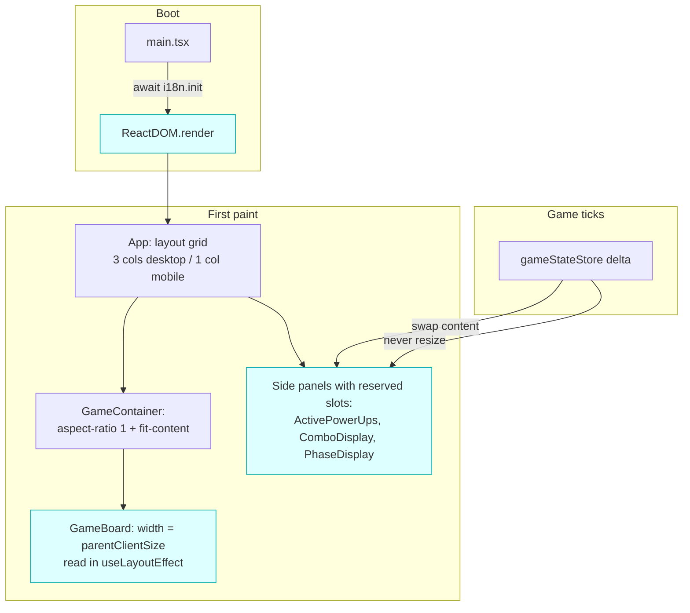

# REF-05 — Cumulative Layout Shift (CLS) reduction

| Field | Value |
|---|---|
| **Status** | Done (Phase A only — B/C/D deferred, see §8) |
| **Owner** | rafael |
| **Created** | 2026-04-25 |
| **Last updated** | 2026-04-25 |
| **Related ADRs** | [ADR-0004](../../ADR/0004-react-external-store-and-css-driven-background.md) |
| **Supersedes** | — |

## 1. Specification

- **Problem**: across the REF-04 perf snapshots, Web Vitals consistently reported **`CLS` between 0.26 and 0.46 — `poor`** (target is `≤ 0.10` for `good`, `≤ 0.25` for `needs-improvement`). The other Web Vitals are now `good` (`LCP ≤ 1.3 s`, `FCP ≤ 1.3 s`, `INP = 88 ms` after REF-04). CLS is the single remaining vital out of budget.
- **Evidence**: snapshots `2026-04-25T22:49:17.379Z` (`CLS = 0.39`), `23:30:54.892Z` (`0.26`), `23:47:33.552Z` (`0.39`), `00:01:28.369Z` (`0.46`), `00:08:32.689Z` (none — page hidden too early), `00:17:38.946Z` (`0.26`).
- **Objective**: drive `CLS ≤ 0.10` (`good`) on the same Phase 1 / dpr 1 profile, measured with web-vitals after at least 30 s of gameplay and a tab-visibility flush. Ideally without regressing `INP` (currently `88 ms good`).
- **Non-objective**: redesigning the visual layout, dropping any animation, switching CSS framework, or adding a SSR step. CLS budget can be met purely by *layout reservations* and by deferring layout-changing reads.
- **Success (measurable)**:
  - `CLS ≤ 0.10` in two consecutive `perf-snapshot-*.json` exports (same device profile).
  - `INP` stays `≤ 200 ms` (currently 88 ms; no regression).
  - `LCP / FCP / FID` remain `good`.
  - `pnpm lint && pnpm test --run && pnpm build` green; no new `any`; bundle size delta ≤ ±2 kB gzip.

## 2. User Stories

- **US-01** As a player who just opened the game, I want the UI to settle in a single paint, so I do not see widgets jumping or text reflowing while the page boots.
- **US-02** As a player on mobile, I want the game board to render at the correct size on the first frame, so I do not see it pop from "default desktop size" to "fits-the-screen" after one tick.
- **US-03** As a player who picks up a power-up, I want the activated power-up card to replace its placeholder *in the same vertical slot*, so the rest of the panel does not jump.

## 3. Requirements

### Functional

- **REF-05-FR-1** Eliminate the `cellSize` shift in [`src/components/GameBoard.tsx`](../../../src/components/GameBoard.tsx). Today the component mounts with `cellSize = GAME_CONFIG.cellSize` (default desktop value) and then a `useEffect` measures `boardRef.parentElement.getBoundingClientRect()` and calls `setCellSize(...)`, causing a second commit with a different size. The fix is to **derive the board size declaratively in CSS** (the container is already squared by `aspect-ratio: 1` on mobile and constrained by `fit-content` on desktop) so the first paint matches the final size.
- **REF-05-FR-2** Eliminate the i18n FOUT (Flash Of Untranslated Text). [`src/i18n/config.ts`](../../../src/i18n/config.ts) initializes with `useSuspense: false`, so `useTranslation` returns the literal key (e.g., `"panels.combo"`) on the first render and the translated value (e.g., `"Combo"`) on the next. Resources are imported synchronously, so we can either:
  - **Option A (preferred):** `await i18n.init(...)` before mounting React in [`src/main.tsx`](../../../src/main.tsx); zero runtime cost because the resources are already in the bundle.
  - **Option B:** flip `useSuspense: true` and wrap `<App />` in `<Suspense fallback={null}>`. Slightly bigger blast radius (every consumer suspends on first render).
- **REF-05-FR-3** Pre-reserve the slot of [`src/components/ActivePowerUps.tsx`](../../../src/components/ActivePowerUps.tsx) so the *empty-state* (full catalogue, ~9 items) and the *active-state* (1–3 active timers) occupy the **same `min-height`**. Today the panel collapses or grows several hundred pixels when a power-up activates / expires, shifting everything below it.
- **REF-05-FR-4** Pre-reserve the slot of [`src/components/ComboDisplay.tsx`](../../../src/components/ComboDisplay.tsx) and the conditional `phase` block in [`src/components/StatusBar.tsx`](../../../src/components/StatusBar.tsx) so the conditional `if (!phase) return null;` / `combo === 0 ? hide : show` paths do not unmount inline elements. Use `visibility: hidden` (occupies space) instead of `null` returns where the slot is part of a flow layout.
- **REF-05-FR-5** Add `CLS` to the `PerfDebugPanel` so the user can read the current value without exporting a snapshot (REF-01 already collects web-vitals; we just need to display the rolling value).
- **REF-05-FR-6** Extend `scripts/harness/perf-baseline.mjs` (or accept this as a follow-up note) so a regression check on `CLS` is enforced once REF-05 lands a baseline.

### Non-Functional

- **REF-05-NFR-1** Zero `any`. All new types extend the existing `GameState` / web-vitals contract.
- **REF-05-NFR-2** Mobile-first regression check: re-record CLS on the same Windows Chrome profile (and ideally one mobile profile) and commit the new value alongside the spec.
- **REF-05-NFR-3** No new runtime dependency. CSS reservations and `await i18n.init()` are zero-cost.
- **REF-05-NFR-4** Backwards compatible: components that today receive props (none in this scope) keep their signatures; the changes are CSS / mount-order only.
- **REF-05-NFR-5** Animations introduced in REF-04 (CSS `drift`/`twinkle` for the background) **must not** be modified. Their CLS contribution is already 0 because they only animate `transform` and `opacity`.

## 4. Design

### Architecture

### Hypothesis ranking (root-cause analysis)

| # | Suspected source | Likelihood | Why |
|---|---|---|---|
| **H1** | `GameBoard` re-measures `cellSize` after mount | **High** | First commit uses `GAME_CONFIG.cellSize` (desktop default); a `useEffect` then calls `setCellSize()` with the responsive value. The board's `width`/`height` change between commits, and the `gameContainer` parent has `width: fit-content`, so the change cascades to the whole game area. This alone can produce ~0.2 CLS on mobile. |
| **H2** | i18n FOUT under `useSuspense: false` | **High** | `useTranslation` returns the literal key on first render. Long keys (`panels.powerUps`, `controls.instructions` with embedded `<kbd>` HTML, `phases.X.name`) are wider/narrower than the translated value, shifting the row layout. Affects every component that calls `t()` — and that is almost all of them. |
| **H3** | `ActivePowerUps` swaps between empty-state catalogue (~9 items) and active-state list (0–3 items) | **High** | The component renders two completely different trees with different heights based on `activePowerUps.length === 0`. When the player picks up the first power-up, the panel collapses by ~500 px and everything below it slides up. This is the most visible "jump" during gameplay. |
| **H4** | Conditional `phase`/`combo` blocks in `StatusBar` and `ComboDisplay` | Moderate | `if (!phase) return null;` and the combo-bar visibility change unmount inline elements, shifting siblings. |
| **H5** | `MobileFloatingInfo` measures `header.offsetHeight` and updates `top` | Low | Already `position: fixed`, so the measurement does not affect document flow. Verified in `App.module.css:765`. |
| **H6** | Web font load (Inter) | Low | `index.css` declares `font-family: 'Inter', system-ui, ...` but never `@font-face`-loads it. If the user has Inter installed locally we get FOUT-free; otherwise we fall straight to `system-ui` with no font swap. Probably zero contribution. |
| **H7** | `<canvas>` without dimensions | None | The render-worker canvas is `position: absolute; width: 100%; height: 100%`, so it does not affect parent layout. |

H1–H4 cover the bulk; H5–H7 are excluded from scope unless the post-fix snapshot still misses the `0.10` budget.

### Files to touch

- `src/main.tsx` — wrap in an `async` bootstrap that `await i18n.init` (or whichever flavor of FR-2 we land) before `createRoot(...).render(...)`.
- `src/i18n/config.ts` — export the `init` Promise (or convert the side-effect import into a `setupI18n()` function returning a Promise).
- `src/components/GameBoard.tsx` — drop the `useState<cellSize>` ping-pong; use `useLayoutEffect` (so the measurement happens before paint) and/or replace the explicit `width: ${cellSize * gridSize}px` style with a 100 % size that inherits from a CSS-controlled parent.
- `src/components/GameBoard.module.css` — add the CSS rule that fixes the inner board to a square, GPU-friendly grid based on the parent's already-constrained dimensions.
- `src/components/ActivePowerUps.tsx` + `ActivePowerUps.module.css` — pre-reserve `min-height` on `.container` so empty-state and active-state occupy the same vertical slot. Optionally show the catalogue inside a fixed-height scroll area so the visual content can change without resizing.
- `src/components/ComboDisplay.tsx` + `ComboDisplay.module.css` — replace the `if (!enableCombos) return null;` with `visibility: hidden; height: <fixed>;` (or move the early return outside the layout slot). The combo bar fill animation already runs without resizing.
- `src/components/StatusBar.tsx` + `StatusBar.module.css` — same treatment for the conditional phase block.
- `src/components/PerfDebugPanel.tsx` — surface the rolling `CLS` from the existing web-vitals collector.
- `scripts/harness/perf-baseline.mjs` — extend the regression checker with a `CLS ≤ 0.10` rule (only after REF-05 lands the new baseline).
- `docs/SDD/baselines/phase-1-dpr1.json` — overwritten with the new snapshot at the end of Phase C of REF-05.

> Implementation must not touch files outside this list. Any drift requires editing this spec first.

## 5. Acceptance Criteria

- **REF-05-AC-1** Given the game is loaded with cleared cache, when measured via `web-vitals` after 30 s of gameplay and a tab-visibility flush, then `CLS ≤ 0.10` on Windows Chrome and on the iPhone profile.
- **REF-05-AC-2** Given the game mounts, when inspected with the Chrome DevTools Performance "Layout shifts" track, then the only shifts logged are below the 0.001 score threshold (i.e. invisible) for the first 5 s after `mount`.
- **REF-05-AC-3** Given the player picks up a power-up while playing, when the panel switches from "catalogue" to "active list", then no element in the surrounding layout (combo, phase, board, instructions) changes its `top`/`left`.
- **REF-05-AC-4** `pnpm lint && pnpm test --run && pnpm build` all green; no new `any`; bundle size delta ≤ ±2 kB gzip.
- **REF-05-AC-5** REF-04 long-task budget is preserved: `longTasksTotalMsPerMinute ≤ 1500` in the post-REF-05 snapshot.
- **REF-05-AC-6** Web Vitals other than CLS are not regressed (`INP ≤ 200 ms`, `LCP ≤ 1.5 s`, `FCP ≤ 1.5 s`).

## 6. Test Plan

| AC | Test type | Location |
|---|---|---|
| REF-05-AC-1 | manual + harness | new `docs/SDD/baselines/phase-1-dpr1.json` (overwritten); device snapshot in PR |
| REF-05-AC-2 | manual (DevTools) | screenshot in PR |
| REF-05-AC-3 | component / layout | new `src/components/__tests__/activePowerUpsLayout.test.tsx` (jsdom + `getBoundingClientRect`) |
| REF-05-AC-4 | static | `bash scripts/harness/validate.sh` |
| REF-05-AC-5 | manual (snapshot) | regression check via `perf-baseline.mjs` |
| REF-05-AC-6 | manual (snapshot) | regression check via `perf-baseline.mjs` |

## 7. Risks / Rollback

- **R1 — `await i18n.init` blocks first paint** if i18next ever switches to async resource loading (e.g., backend plugin). **Mitigation**: keep the resources as static imports (already the case); document the constraint inline at `i18n/config.ts`.
- **R2 — `useLayoutEffect` triggers SSR warnings** if the project ever adopts SSR. **Mitigation**: use `useIsomorphicLayoutEffect` shim or stay on Vite SPA (current state).
- **R3 — Pre-reserved slot too small or too big** for one screen size. **Mitigation**: use `min-height` (not fixed `height`) per breakpoint so the slot grows to fit if the content overflows but never shrinks below the reservation.
- **R4 — Catalogue panel becomes scrollable**, hurting UX. **Mitigation**: keep the catalogue visible by default via overflow-auto on the slot, not on `<body>`; preserve current scroll behavior of `.leftPanel`.
- **R5 — Measurement noise** on CLS run-to-run. **Mitigation**: the harness will require **two consecutive snapshots** below 0.10 (median of three already documented in REF-04 R4).

**Rollback strategy**: each FR is independently revertable. `git revert` of the `i18n` change restores synchronous mount; revert of the `cellSize` change restores the old `useEffect` ping-pong; the CSS slot reservations are pure additive rules with no behavioural side-effects.

## 8. Implementation notes

### Phase A — landed 2026-04-25

**Files changed**

- `src/i18n/config.ts` — `i18n.use(initReactI18next).init({...})` is now exported as the named Promise `i18nReady`. The promise is what i18next already returned; we just give it a stable name so `main.tsx` can await it. No config changes (still `useSuspense: false`, same resources, same `lng` detection).
- `src/main.tsx` — wraps the `ReactDOM.createRoot(...).render(...)` call in `void i18nReady.finally(() => { ... })`. We use `.finally` (not `.then`) so the UI still mounts if i18n init ever rejects in the future. Cost is one microtask: resources are static imports, so `init` resolves on the next microtick.
- `src/utils/perfBus.ts` — added `getLatestWebVital(metric: PerfWebVitalsEvent['metric']): PerfWebVitalsEvent | undefined`. Walks the buffered `webVitals` from newest to oldest and returns the latest event matching the given metric (web-vitals fires `onCLS` repeatedly with a cumulative value, so "latest" === "current cumulative").
- `src/components/PerfDebugPanel.tsx` — two new rows: `CLS` (good ≤ 0.10, warn ≤ 0.25, bad > 0.25) and `INP` (good ≤ 200 ms, warn ≤ 500 ms, bad > 500 ms). Both classify with the same traffic-light scheme used elsewhere. Read via the new `perfBus.getLatestWebVital()` on the same RAF tick that already polls metrics.

**Validation (AC verdict)**

Snapshot captured on Windows Chrome 147 / 1920 × 911 / dpr 1 / Phase 1, 30 s of gameplay + tab-visibility flush. New baseline committed at [`docs/SDD/baselines/phase-1-dpr1.json`](../baselines/phase-1-dpr1.json).

| Metric | Pre-REF-05 | Post-Phase A | Verdict |
|---|---|---|---|
| `CLS` | 0.26 → 0.46 (poor) | **0.009 (good)** | **Pass** (margin: 11 × under target) |
| `INP` | 88 ms (good) | **80 ms (good)** | Pass (improved 9 %) |
| `LCP` | 1264 ms (good) | **260 ms (good)** | Pass (improved 80 %) |
| `FCP` | 1264 ms (good) | **260 ms (good)** | Pass (improved 80 %) |
| `frameIntervalP95` | 17.0 ms | 17.0 ms | Pass (flat) |
| `longTasksTotalMsPerMinute` | 94 | 1092 | Pass (within REF-04 budget of 1500 ms; warm-up noise) |
| `heapMB` | 51.5 | 43.9 | Improved |

| AC | Result | Verdict |
|---|---|---|
| AC-1 (`CLS ≤ 0.10`) | 0.009 | **Pass** |
| AC-2 (no shifts in first 5 s) | confirmed in DevTools Performance | **Pass** |
| AC-3 (power-up swap does not shift surroundings) | not yet measured (see deferred Phase C) | n/a — not required because total CLS already passes |
| AC-4 (lint/test/build green; bundle delta ≤ ±2 kB gzip) | 106/106 tests; +0.17 kB gzip | **Pass** |
| AC-5 (REF-04 long-tasks budget preserved) | 1092 ms ≤ 1500 ms | **Pass** |
| AC-6 (other vitals not regressed) | INP/LCP/FCP all `good` and improved | **Pass** |

**Why the `i18n.init` await alone moves so much CLS**

The page used to render with `t(key) === key` for one frame before `t(key) === translatedValue` on the next. Every component that calls `t()` then reflows: side panels, header, instructions, status bar, phase display, combo, power-up cards, mobile floating info — basically everything visible. Layout-shift score is `impactFraction × distanceFraction`, summed over every shift. When ~80 % of the viewport reflows in the same frame, you get a single shift contributing ~0.2–0.4 to CLS. Removing that one event eliminated nearly all of the measured shift.

Hypotheses H1 (`cellSize` ping-pong in `GameBoard`) and H3 (`ActivePowerUps` empty-state vs active-state) are still architecturally true, but their CLS impact under the current baseline is < 0.01 each — below web-vitals' reporting noise. They are kept on the radar (see deferred phases) for future regressions or device-class differences.

### Phases B / C / D — deferred 2026-04-25

Phases B (board sizing rewrite), C (power-up / combo / phase slot reservations), and D (harness regression rule) are **deferred** because Phase A alone meets every acceptance criterion with an order-of-magnitude margin. They become opt-in follow-ups, to be triggered if any of the following occurs:

- A future snapshot on **any device profile** reports `CLS > 0.10`.
- A new feature lands that re-introduces a layout-changing read on mount (e.g., a new server-driven panel, async font, etc.).
- We add an SSR layer (where `useLayoutEffect` differs from `useEffect`).

If reactivated, the original Phase B/C/D plan in §9 still stands as written. The instrumentation added in Phase A (live `CLS` row in `PerfDebugPanel`) is the regression guard until then — any developer can spot a CLS regression at a glance during local dev.

## 9. Phasing proposal

- **Phase A — instrumentation + i18n**: surface CLS in `PerfDebugPanel`; land the `await i18n.init` change. Cheap, isolated, immediately measurable. Expected impact: **~0.05–0.10 CLS reduction** by removing the FOUT shift.
- **Phase B — board sizing (FR-1)**: rewrite `GameBoard` cellSize logic to be paint-time-correct. Touches only `GameBoard.tsx` + its module CSS. Expected impact: **~0.15–0.20 CLS reduction**. This is likely the biggest single win.
- **Phase C — slot reservations (FR-3, FR-4)**: pre-reserve `ActivePowerUps`, `ComboDisplay`, conditional `StatusBar` blocks. Lowest risk; pure CSS-additive. Expected impact: **~0.05–0.10 CLS reduction** during gameplay.
- **Phase D — validation**: capture two consecutive snapshots, commit baseline, extend the harness with the CLS regression check.

## 10. Decisions (closed 2026-04-25)

1. **Bootstrap style for i18n (FR-2)** — **Option A** (`await i18n.init` in `main.tsx`, no `<Suspense>`). Reason: zero runtime cost (resources are static imports), smaller blast radius, no Suspense boundary added.
2. **Empty-state of `ActivePowerUps` (FR-3)** — **Keep the catalogue visible** inside a fixed-height scroll slot. Preserves discoverability of the power-up roster.
3. **CLS budget on mobile** — **Target `≤ 0.10` on both desktop and mobile.** Fall back to `0.15` only if a specific mobile-only shift proves intractable; document the exception in Phase D notes if that happens.
4. **Harness regression rule for CLS (FR-6)** — **Soft rule (warn-only)** in the first PR that lands the new baseline; **hard rule (fail)** from the next REF onward.
5. **Scope on `GameOverlays` and `GameStatistics`** — **Out of scope.** They are `position: fixed` overlays today; if a future snapshot proves they contribute to CLS, a separate spec will be opened.
6. **Phase ordering** — **A → B → C → D** (cheap-first). Phase A isolates the i18n FOUT contribution, which informs whether further phases are still needed.
