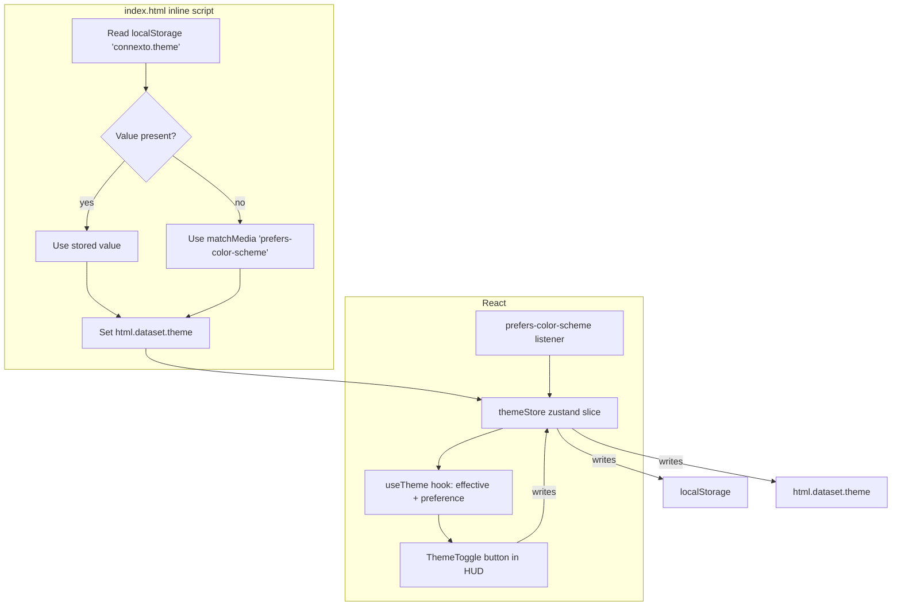

# REF-07 — Light theme mode with automatic and manual toggle

| Field | Value |
|---|---|
| **Status** | Draft |
| **Owner** | rafael |
| **Created** | 2026-04-26 |
| **Last updated** | 2026-04-26 |
| **Related ADRs** | [ADR-0005](../../ADR/0005-neon-arcade-design-system-and-l1-full-bleed-layout.md) — "Neon Arcade design system and L1 full-bleed layout" (Accepted) |
| **Supersedes** | — |
| **Parallel to** | — |

> Status values: `Draft` → `Approved` → `In Progress` → `Done` (or `Blocked`, `Superseded`).

## 1. Specification

- **Problem**: the Neon Arcade design system delivered in REF-06 ships **dark-only**. The placeholder `@media (prefers-color-scheme: light)` in `src/styles/tokens.css:138-144` is explicitly reserved as a future REF and is currently empty — meaning:
  1. Users on bright environments (outdoor, morning sun, brightly lit office) read the UI against a pitch-black board that is perceived as too intense / fatiguing.
  2. Users whose OS is set to light mode still see the dark palette, which is inconsistent with the surrounding system chrome (browser, OS menu bar).
  3. The `IDEIAS_MELHORIAS.md §11` backlog lists "Modo Dark/Light" as a pending Phase-2 deliverable with *Complexidade: Baixa / Impacto: Médio*.
  4. Accessibility: some users with photosensitive astigmatism or dry-eye syndrome report better legibility on light backgrounds. A dark-only product excludes them.
- **Objective**: ship a second fully-working color scheme ("Light") that (a) auto-activates when the OS reports `prefers-color-scheme: light`, (b) can be manually overridden via an explicit toggle that persists in `localStorage`, (c) keeps every WCAG contrast ratio ≥ 4.5:1 (AA) / ≥ 7:1 (AAA) for HUD-critical text — same contract REF-06 holds for dark, (d) adds **zero new runtime dependencies** and stays within +2 kB gzip bundle delta.
- **Non-objective**:
  - Custom / user-authored color palettes (snake color, food color, combo neon choice) — that is REF-08 Skins/Themes, a distinct spec.
  - High-contrast mode beyond what REF-06 already wires via `prefers-contrast: more`.
  - Server-side theme sync / account-based preference — local-only for now.
  - Redesigning any component: light scheme reuses every existing layout, motion, typography, and semantic token name.
- **Success (measurable)**:
  - Owner accepts a side-by-side screenshot of the same game state in **dark** and **light** schemes in the PR.
  - All 52 existing `tokens.spec.ts` contrast assertions pass for **both** `:root` and `:root[data-theme='light']`.
  - Manual toggle persists across full page reloads and survives navigation back from a new tab.
  - Switching the OS scheme while the tab is open changes the theme *unless* the user has a manual override saved.
  - Bundle delta ≤ +2 kB gzip (the whole light scheme is declarative CSS + ~60 LOC of React store).
  - Lighthouse Performance ≥ 95 preserved; CLS ≤ 0.10 preserved (no flash-of-wrong-theme / FOUT equivalent).
  - `pnpm lint && pnpm test --run && pnpm build` green.

## 2. User Stories

- **US-01** As a user browsing in daylight, I want the game to match the brightness of my surroundings so my eyes do not adjust aggressively every time I switch tabs.
- **US-02** As a user with my OS in light mode, I want the game to respect that preference by default so I do not need to configure anything.
- **US-03** As a user who prefers dark mode regardless of my OS (e.g., night owl on a daylight-configured machine), I want a visible in-app toggle that sticks across sessions.
- **US-04** As a user with astigmatism / halation sensitivity, I want a light mode option so glowing neon accents on black do not produce visual artifacts.
- **US-05** As a keyboard-only user, I want the theme toggle reachable via Tab and activatable via Enter / Space, with a correct `aria-pressed` state.
- **US-06** As a returning user, I want my choice remembered — nothing is more annoying than reselecting preferences after every reload.

## 3. Requirements

### Functional

- **REF-07-FR-1** The app exposes three user-facing theme preferences: `'system'` (default), `'dark'`, `'light'`.
- **REF-07-FR-2** On mount, the effective theme is resolved as:
  ```
  explicit_user_choice ?? os_preference (via prefers-color-scheme) ?? 'dark'
  ```
- **REF-07-FR-3** A single `data-theme` attribute on `<html>` drives all color tokens: `<html data-theme='light'>` activates the light palette, absent attribute or `data-theme='dark'` keeps the dark palette.
- **REF-07-FR-4** `src/styles/tokens.css` gains a `:root[data-theme='light'] { ... }` block that overrides `--color-bg-*`, `--color-on-bg-*`, `--color-stroke-*`, `--color-overlay-scrim`, and `--color-surface-translucent`. Semantic accent tokens (`--color-accent-*`, `--color-snake`, `--color-food`, `--color-boss`) stay the same for identity — this is Neon Arcade in both lighting conditions, not two disjoint visual systems.
- **REF-07-FR-5** An empty `@media (prefers-color-scheme: light)` block already exists in `tokens.css`. That block is repurposed to apply the light palette when the user preference is `'system'` (using `:root:not([data-theme])`).
- **REF-07-FR-6** A new `ThemeToggle` component mounts in the HUD `actions` cluster (same row as `AudioToggle` and `LanguageSelector`). Clicking it cycles `system` → `light` → `dark` → `system`, with an inline SVG icon and `aria-label` / `aria-pressed` reflecting current state.
- **REF-07-FR-7** The user's explicit choice (`'light'` or `'dark'`) persists in `localStorage` under key `connexto.theme`. Choosing `'system'` deletes the key so the OS preference takes over again.
- **REF-07-FR-8** A `prefers-color-scheme` media-query listener updates the effective theme in real time **only when** the stored preference is `'system'`.
- **REF-07-FR-9** The `<html>` element carries `color-scheme: dark` or `light` matching the effective theme, so the browser scrollbar / form controls / dialog defaults match.
- **REF-07-FR-10** Theme is resolved *before first paint* via an inline `<script>` snippet in `index.html`, preventing flash-of-wrong-theme (FOUT equivalent).

### Non-Functional

- **REF-07-NFR-1** Light palette must hold **AA 4.5:1** contrast on every `--color-bg-*` / `--color-on-bg-*` pair and **AAA 7:1** on HUD-critical pairs (score / lives / combo). Enforced by extending `src/styles/__tests__/tokens.spec.ts` to loop both themes.
- **REF-07-NFR-2** Zero new runtime dependencies (no `next-themes`, no `use-color-scheme`, etc.). React + native `matchMedia` + `localStorage` are enough.
- **REF-07-NFR-3** Bundle delta ≤ **+2 kB gzip** (measured against the current 111.78 kB JS / 16.50 kB CSS baseline). The light palette is ~50 CSS declarations; the React store + toggle + inline script sum to ~80 LOC.
- **REF-07-NFR-4** `prefers-reduced-motion` must be honored for any CSS transition used on theme change (e.g., `.app { transition: background-color 120ms ease; }` becomes `transition: none` under reduced motion).
- **REF-07-NFR-5** No `any`. No `as Type` casts beyond `HTMLElement` narrowing on `document.documentElement`. `readonly` on prop interfaces. Explicit return types on public functions.
- **REF-07-NFR-6** SSR-safe: the store must not throw on SSR-style imports (even though this is a Vite SPA, the inline script in `index.html` runs before React hydrates, so `window` access has to be defensive).
- **REF-07-NFR-7** Theme change must not break the REF-04 long-task budget. Target: < 5 ms of main-thread work on toggle. Measured via performance marks in a dev-only harness.
- **REF-07-NFR-8** i18n: the new toggle's tooltip / `aria-label` uses keys `theme.auto`, `theme.light`, `theme.dark` in both `en-US` and `pt-BR` locales.

## 4. Design

### Architecture



### Contracts

```ts
// src/state/themeStore.ts (new)
export type ThemePreference = 'system' | 'light' | 'dark';
export type EffectiveTheme = 'light' | 'dark';

export interface ThemeState {
  readonly preference: ThemePreference;
  readonly effective: EffectiveTheme;
  setPreference(next: ThemePreference): void;
  cyclePreference(): void;
}

export const THEME_STORAGE_KEY = 'connexto.theme' as const;

// src/hooks/useTheme.ts (new) — just a thin selector over themeStore
export function useTheme(): Pick<ThemeState, 'preference' | 'effective' | 'setPreference' | 'cyclePreference'>;

// src/components/ThemeToggle.tsx (new)
// Props: none. Reads from useTheme, dispatches cyclePreference.
```

### Files to touch

| Path | Change |
|---|---|
| `index.html` | Add inline boot script (~12 LOC) that sets `data-theme` before React mounts, preventing FOUT. |
| `src/styles/tokens.css` | Add `:root[data-theme='light'] { ... }` block. Fill the empty `@media (prefers-color-scheme: light)` block to target `:root:not([data-theme])`. Maintain OKLCH primitives inside `@supports (color: oklch(0 0 0))`. |
| `src/state/themeStore.ts` | **New**. Zustand slice exposing `preference`, `effective`, `setPreference`, `cyclePreference`. Hydrates from `localStorage`, syncs to `document.documentElement.dataset.theme` + `document.documentElement.style.colorScheme`, listens to `matchMedia('(prefers-color-scheme: light)')`. |
| `src/hooks/useTheme.ts` | **New**. Selector hook over the store. |
| `src/components/ThemeToggle.tsx` | **New**. Button in HUD actions. SVG icon swaps (sun / moon / auto). `aria-pressed` / `aria-label` follow WAI-ARIA toggle-button guidance. |
| `src/components/ThemeToggle.module.css` | **New**. Mirrors `AudioToggle.module.css` visual language. |
| `src/components/HudStrip.tsx` | Insert `<ThemeToggle />` in `.actions` between `AudioToggle` and `LanguageSelector`. |
| `src/i18n/locales/en-US.json` | Add `theme.auto`, `theme.light`, `theme.dark`, `theme.cycleAriaLabel` keys. |
| `src/i18n/locales/pt-BR.json` | Same keys, translated. |
| `src/styles/__tests__/tokens.spec.ts` | Extend existing contrast test matrix to run under both `data-theme='dark'` (default) and `data-theme='light'`. |
| `src/state/__tests__/themeStore.test.ts` | **New**. Unit tests: hydration precedence, persistence, matchMedia reactivity, cycle order. |
| `src/components/__tests__/ThemeToggle.test.tsx` | **New**. RTL test: renders three states, `aria-pressed` correct, click dispatches cycle. |
| `docs/SDD/specs/REF-07-theme-light-mode.md` | This document. |

> Implementation must not touch files outside this list.

### Light palette (initial proposal — subject to owner tweak during Phase A)

Mapping from the dark scheme, preserving **token identity** (same `--color-bg-base` token, different HSL / OKLCH value):

| Token | Dark (current) | Light (proposed) | Intent |
|---|---|---|---|
| `--color-bg-base` | `oklch(0.13 0.04 270)` | `oklch(0.97 0.01 260)` | app background |
| `--color-bg-surface` | `oklch(0.18 0.05 270)` | `oklch(0.94 0.015 260)` | card/panel |
| `--color-bg-elevated` | `oklch(0.24 0.06 270)` | `oklch(0.89 0.02 260)` | elevated surface |
| `--color-bg-hover` | `oklch(0.32 0.07 270)` | `oklch(0.84 0.03 260)` | hover surface |
| `--color-on-bg` | `oklch(0.98 0.01 270)` | `oklch(0.18 0.02 260)` | primary text |
| `--color-on-bg-strong` | same | `oklch(0.10 0.02 260)` | strongest text |
| `--color-on-bg-muted` | `oklch(0.85 0.02 270)` | `oklch(0.40 0.02 260)` | secondary text |
| `--color-on-bg-faint` | `oklch(0.65 0.02 270)` | `oklch(0.55 0.02 260)` | tertiary text |
| `--color-stroke-subtle` | `rgb(255 255 255 / 0.08)` | `rgb(0 0 0 / 0.08)` | border inversion |
| `--color-stroke-soft` | `rgb(255 255 255 / 0.16)` | `rgb(0 0 0 / 0.14)` | |
| `--color-stroke-strong` | `rgb(255 255 255 / 0.28)` | `rgb(0 0 0 / 0.24)` | |
| `--color-overlay-scrim` | `rgb(10 13 26 / 0.72)` | `rgb(240 243 255 / 0.72)` | drawer scrim |
| `--color-surface-translucent` | `rgb(19 24 41 / 0.78)` | `rgb(244 247 255 / 0.82)` | floating surfaces |
| Accent tokens (`--color-accent-*`, snake, food, boss) | — | **unchanged** | Neon Arcade identity |
| `--shadow-elev-1/2` | black-based | softened gray | mellow elevation on light |

Neon accents stay the same because the game is recognizable across themes. Shadows soften — black-on-light at `0.55` alpha looks grimy; `rgb(30 40 70 / 0.18)` reads as a true elevation shadow.

### Boot script (inline in `index.html`)

```html
<script>
  (function () {
    try {
      var stored = localStorage.getItem('connexto.theme');
      var effective;
      if (stored === 'light' || stored === 'dark') {
        effective = stored;
      } else {
        effective = window.matchMedia('(prefers-color-scheme: light)').matches ? 'light' : 'dark';
      }
      document.documentElement.setAttribute('data-theme', effective);
      document.documentElement.style.colorScheme = effective;
    } catch (_) {
      document.documentElement.setAttribute('data-theme', 'dark');
    }
  })();
</script>
```

Inline because any async/deferred module risks a visible flash on the first paint. ~330 bytes minified, not worth splitting.

## 5. Acceptance Criteria

- **REF-07-AC-1** *Given* the user has never picked a theme and their OS reports `prefers-color-scheme: light`, *when* they open the app, *then* `<html data-theme='light'>` is set **before** the first React render and the light palette is visible on initial paint (no flash).
- **REF-07-AC-2** *Given* the user has never picked a theme and their OS reports `prefers-color-scheme: dark` (or nothing), *when* they open the app, *then* `<html data-theme='dark'>` is set and the existing dark palette is visible.
- **REF-07-AC-3** *Given* the user clicks the theme toggle three times starting from `system`, *when* each click fires, *then* `preference` cycles through `system → light → dark → system` exactly, and the `aria-pressed` / icon reflect each state.
- **REF-07-AC-4** *Given* the user selected `light`, *when* they reload the page, *then* the app boots into `light` regardless of their OS preference.
- **REF-07-AC-5** *Given* the user selected `system` (or never chose), *when* the OS toggles dark ↔ light while the tab is open, *then* the effective theme flips in real time without a reload.
- **REF-07-AC-6** *Given* the light theme is active, *when* the contrast matrix runs in `tokens.spec.ts`, *then* every `--color-on-bg-*` / `--color-bg-*` pair scores ≥ 4.5:1 and HUD-critical pairs score ≥ 7:1 — same contract already enforced for dark.
- **REF-07-AC-7** *Given* the preview build, *when* `pnpm build` completes, *then* JS gzip delta ≤ 2 kB and CSS gzip delta ≤ 1 kB vs the current `111.78 kB` / `16.50 kB` baseline.
- **REF-07-AC-8** *Given* a keyboard-only user, *when* they Tab to the theme toggle and press Enter, *then* the cycle fires — verified in the RTL test.

## 6. Test Plan

| AC | Test type | Location |
|---|---|---|
| REF-07-AC-1 / AC-2 | boot-script unit | `src/state/__tests__/themeStore.test.ts` (mock `matchMedia` + `localStorage`) |
| REF-07-AC-3 / AC-8 | component (RTL) | `src/components/__tests__/ThemeToggle.test.tsx` |
| REF-07-AC-4 | store unit | `src/state/__tests__/themeStore.test.ts` (hydration from localStorage) |
| REF-07-AC-5 | store unit | `src/state/__tests__/themeStore.test.ts` (simulate `matchMedia.onchange` events) |
| REF-07-AC-6 | contrast matrix | `src/styles/__tests__/tokens.spec.ts` (extend existing suite) |
| REF-07-AC-7 | manual bundle audit | compare `dist/assets/index-*.{css,js}` pre/post |

Plus:

- `pnpm lint` clean.
- `pnpm tsc --noEmit` clean.
- `pnpm build` clean.
- Manual side-by-side screenshot in the PR (dark + light, same scene).

## 7. Risks / Rollback

- **R1** *Flash of wrong theme on first paint.* React mounts after HTML/CSS; without the inline boot script, the default dark palette would render for ~80 ms before the store hydrates. **Mitigation**: inline boot script in `index.html`, measured before React hydrates. Fallback to `dark` if `localStorage`/`matchMedia` throws.
- **R2** *Light palette fails AA contrast on edge pairs (e.g., `--color-on-bg-muted` on `--color-bg-hover`).* **Mitigation**: the contrast test suite is run as part of CI and will block the merge if any pair drops below threshold. Iteration happens in-test.
- **R3** *Neon accents (`--color-accent-primary = neon-cyan`) look too bright / washed on light backgrounds.* **Mitigation**: accents stay identical for brand identity; if any accent fails the AA check on `--color-bg-base`, fall back to a per-theme accent variant inside the `[data-theme='light']` block. This is an opt-in knob, not the default.
- **R4** *Scrollbars / form controls (language selector) look wrong when `<html style="color-scheme: light">` flips.* **Mitigation**: explicitly set `color-scheme` alongside `data-theme` in the boot script, so UA-painted controls respect the theme.
- **R5** *Bundle regression.* **Mitigation**: NFR-3 caps CSS delta at +1 kB gzip and JS delta at +2 kB gzip. If exceeded, remove token duplicates and stop at OKLCH-only (no sRGB fallback for light; modern browsers all support OKLCH as of 2026).

**Rollback strategy**: the entire spec is additive — zero existing behavior is altered. To roll back:
1. Delete the inline boot script from `index.html`.
2. Delete `:root[data-theme='light']` block from `tokens.css` (keep the existing empty `@media (prefers-color-scheme: light)` block as-is).
3. Remove `<ThemeToggle />` mount from `HudStrip.tsx`.
4. Delete `src/state/themeStore.ts`, `src/hooks/useTheme.ts`, `src/components/ThemeToggle.*`, and their tests.
5. `pnpm lint && pnpm test && pnpm build` still green — no production regression.

No feature flag required (change is toggle-local).

## 8. Implementation notes (filled when status = Done)

_To be filled after implementation._

- Final files changed: …
- Deviations from Design section: …
- Follow-ups (link to new specs/issues if any): …

## 9. Phasing

| Phase | Deliverable | Owner gate |
|---|---|---|
| **A — Contrast matrix + palette** | Write `:root[data-theme='light']` tokens. Extend `tokens.spec.ts` to loop both themes. Validate AA/AAA before writing any UI. | Owner sign-off on the proposed light palette values in §4. |
| **B — Store + boot script** | Ship `themeStore`, `useTheme`, inline boot script. No UI yet. Verify manually via DevTools `document.documentElement.setAttribute('data-theme','light')`. | Gate: tests green, no FOUT on reload. |
| **C — ThemeToggle component + HUD mount** | Visible in-app toggle, cycle state, aria + i18n keys. | Owner approves visual + interaction. |
| **D — Validation + docs** | Bundle audit, Lighthouse re-check, screenshots, spec §8 implementation notes, ADR update if needed. | Spec moves to `Done`. |

Each phase is independently releasable — if B is green but C is not ready for owner review, the feature flag equivalent is "no `<ThemeToggle />` mount yet" — the palette and store still function.
