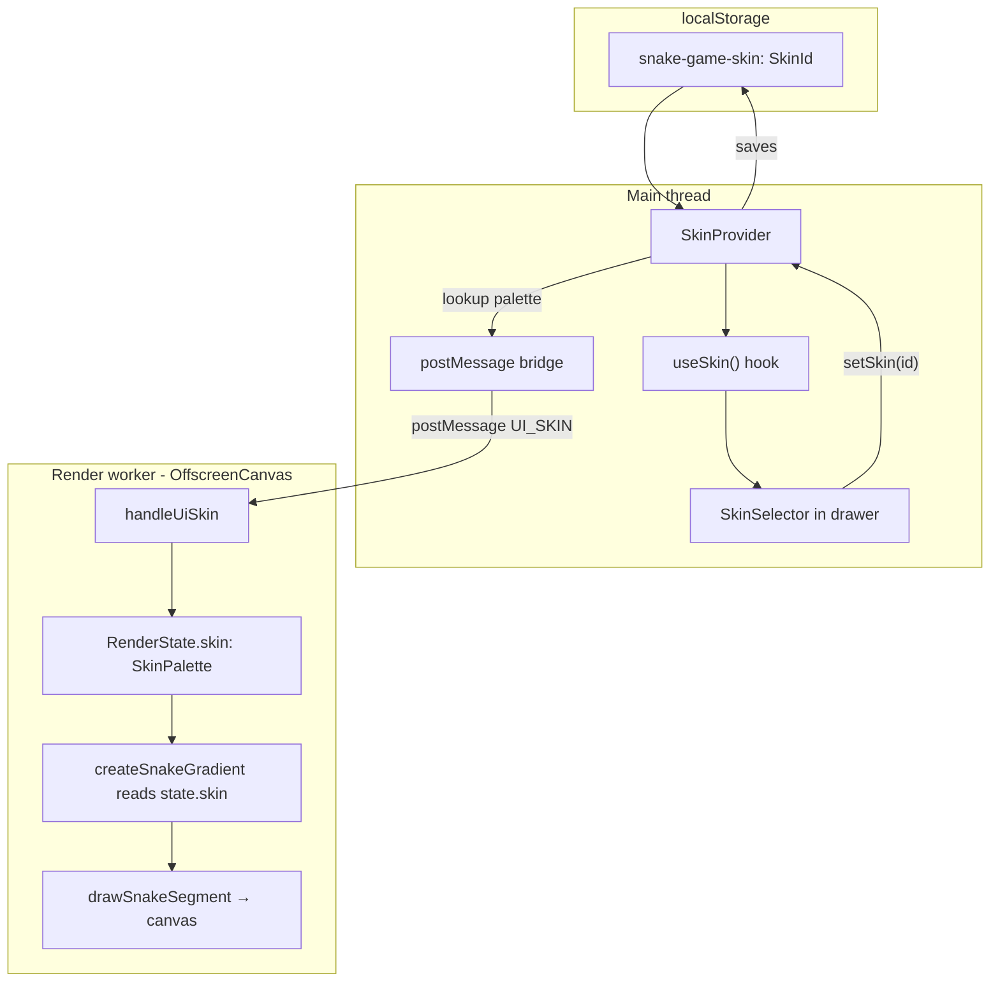

# REF-08 — Snake skins system (player-canvas personalization)

| Field | Value |
|---|---|
| **Status** | In Progress (Phase C landed) |
| **Owner** | rafael |
| **Created** | 2026-04-26 |
| **Last updated** | 2026-04-26 |
| **Related ADRs** | [ADR-0005](../../ADR/0005-neon-arcade-design-system-and-l1-full-bleed-layout.md) — "Neon Arcade design system and L1 full-bleed layout" (Accepted). A new ADR-0006 will be authored in Phase D to document the orthogonal-identity axes decision (chrome theme × canvas skin × phase weather). |
| **Related specs** | [REF-07](REF-07-theme-light-mode.md) — Light theme mode (Done). REF-08 consumes REF-07's `data-theme` infrastructure for skin-preview contrast but does not extend it. |
| **Supersedes** | — |
| **Parallel to** | — |

> Status values: `Draft` → `Approved` → `In Progress` → `Done` (or `Blocked`, `Superseded`).

## 1. Specification

- **Problem**: the snake renderer in `src/workers/render/renderDrawers.ts::createSnakeGradient` (lines 33–58) hardcodes three hex literals per branch (`head`: `#86efac / #22c55e / #15803d`; `body`: `#4ade80 / #16a34a / #14532d`; `boss`: derived from `activeBoss.color`). That means:
  1. Every player sees the same green snake, regardless of progression, preference, or aesthetic. The Neon Arcade identity is monolithic on the only game element the player looks at for 99 % of the session — the snake itself.
  2. The project's achievement system (`src/constants/achievements.ts`, 9 milestones) is currently pure vanity — unlocks fire a notification but grant nothing. Nothing engages returning players after the first session.
  3. The `IDEIAS_MELHORIAS.md §16` backlog flags "Sistema de Skins/Temas" as `Complexidade: Média / Impacto: Alto` and explicitly pending. The infrastructure that would make it cheap — cascaded attributes on `:root`, typed palettes in `tokens.css`, contract tests in `tokens.spec.ts` — just shipped via REF-07.
  4. The render worker is in an `OffscreenCanvas` and has **no** direct access to `document.documentElement.dataset.*`. Any skin control must travel via `postMessage`. The existing `handleUiHint` / `handleUiLocale` handlers in `src/workers/render/renderState.ts` already establish the exact pattern REF-08 needs.
- **Objective**: ship **four** visually distinct snake skins, selectable at any time from the drawer Settings section, persisted locally, with **zero impact on the game loop / physics / collision**. The player canvas personality becomes a first-class identity axis, orthogonal to the chrome theme (dark / light) shipped in REF-07 and to the background weather (10 climas per phase) already in the game.
- **Non-objective**:
  - Skin-gating behind achievements / score / progression — decided **all free from day 1** (ref Q3 of approval; zero friction, immediate value; progression can be added later as a non-breaking extension).
  - Food / obstacle / portal / trail / particle skins — the render pipeline for each of those is orthogonal to the snake path; attempting to skin them here triples the surface area of the spec. Each belongs in its own future REF.
  - Boss-snake skin override — bosses keep their `activeBoss.color` identity; only a **contrast-derived stroke** (outline) reflects the player's skin. The full override ("boss also skinned") was explicitly considered and rejected because it erases the 10 unique boss narrative identities already shipped.
  - Server-side skin sync / account preferences — local-only.
- **Success (measurable)**:
  - Owner accepts a side-by-side screenshot of the game running with all four skins (ideally same frame captured twice in dark + light chrome themes).
  - All four skins pass the new `src/constants/__tests__/skins.test.ts` contract — primary skin color ≥ 3:1 against `--color-bg-base` in both themes, head lighter than body in every palette (APCA-ordering invariant).
  - Switching a skin updates the canvas within ≤ 1 render frame (`isRenderDirty = true` forced by the new `handleUiSkin` handler).
  - Manual choice survives a full reload and a new tab (`localStorage['snake-game-skin']`).
  - Bundle delta ≤ **+5 kB gzip** vs. REF-07 `Done` baseline (130.63 kB gzip total).
  - Lighthouse Performance ≥ 95 preserved; no regression in CLS, INP, frame-interval or long tasks (same render loop, same worker cadence, six gradient stops read from state instead of being literal).
  - `pnpm lint && pnpm test --run && pnpm build` green.

## 2. User Stories

- **US-01** As a returning player, I want to customize how my snake looks so the game feels uniquely mine and not identical to every other player's session.
- **US-02** As a player tired of the default green, I want a visible, one-click way to swap to a different color family (retro arcade, icy cyan, magenta blaze) without leaving the current game flow.
- **US-03** As a keyboard-only user, I want the skin selector reachable via Tab and navigable via ArrowLeft / ArrowRight / Home / End inside a radiogroup, consistent with the ThemeToggle shipped in REF-07.
- **US-04** As a user on any chrome theme (dark or light), I want every skin to remain visually distinct on its background — no skin should "disappear" when I flip the chrome theme.
- **US-05** As a returning user, I want my skin choice remembered across reloads and across tabs, same behavior as my theme choice.
- **US-06** As a player mid-match, I want to swap skins without interrupting the game, seeing the change within one frame.
- **US-07** As a player facing a boss, I want my own snake to stay visually distinct from the boss snake even after I flip skins; the boss should not adopt my color palette.

## 3. Requirements

### Functional

- **REF-08-FR-1** The app ships with exactly four skins, identified by a stable `SkinId` union: `'neon-green'` (default) · `'retro-arcade'` · `'frozen-ice'` · `'magenta-blaze'`.
- **REF-08-FR-2** Each skin is defined by a `SkinPalette` with six gradient stops (three for body, three for head), plus a three-stop contrast triad for boss outline derivation. See §4 Contracts.
- **REF-08-FR-3** A new `UI_SKIN` message type is added to the render worker protocol. The main thread posts `{ type: 'UI_SKIN', payload: { skin: SkinPalette } }` on every preference change; the worker merges it into `RenderState.skin` and forces `isRenderDirty = true`.
- **REF-08-FR-4** `createSnakeGradient` reads the three stops for body / head from `state.skin` instead of hardcoded literals. The boss branch (`if (isBoss)`) continues to use `activeBoss.color` for the primary gradient stop but **derives its outline stroke** from `state.skin.bossContrast` so the boss reads visually distinct from the player snake regardless of which skin is active.
- **REF-08-FR-5** A new `SkinContext` + `useSkin()` hook manages the active skin's `SkinId`. Pattern mirrors `ThemeContext` exactly: `readonly` fields, `useMemo`, `useCallback`. No Zustand, no new runtime dependency.
- **REF-08-FR-6** The user's choice persists under `localStorage['snake-game-skin']`. An unknown / invalid value falls back to `'neon-green'`.
- **REF-08-FR-7** A new `SkinSelector` component renders a WAI-ARIA `radiogroup` of four radio buttons inside the `PowerUpsLegendDrawer` Settings section, immediately below the `ThemeToggle`. Each option shows a 20 px circular swatch filled with the skin's head-gradient + a short label. `aria-label` on the group and `aria-checked` on each option.
- **REF-08-FR-8** Keyboard navigation inside the selector: ArrowLeft / ArrowRight cycle, Home selects first, End selects last, Space / Enter activate. Matches the WAI-ARIA 1.2 radiogroup pattern.
- **REF-08-FR-9** Changing the skin in the selector:
  1. Updates `SkinContext` state → triggers re-render of the selector only (no re-render of the game canvas tree, which is driven by the worker).
  2. Persists to `localStorage`.
  3. Dispatches a `postMessage` to the render worker with the new `SkinPalette`.
  4. Confirms by visually updating the canvas on the next worker frame (≤ 16.67 ms @ 60 Hz).
- **REF-08-FR-10** i18n strings: `skin.title`, `skin.groupLabel`, `skin.neonGreen`, `skin.retroArcade`, `skin.frozenIce`, `skin.magentaBlaze`. Shipped in both `en-US` and `pt-BR`.
- **REF-08-FR-11** `RenderState` ships with `skin` initialized to the default `neon-green` palette so the first paint before any postMessage arrives is identical to the pre-REF-08 baseline — zero visual regression for users who never touch the selector.

### Non-Functional

- **REF-08-NFR-1** Contract test `src/constants/__tests__/skins.test.ts`: every skin's head stop 0 and body stop 0 maintain ≥ 3:1 APCA-approximated contrast against `--color-bg-base` in *both* `dark` and `light` themes. Head gradient's luma must be strictly greater than the body's to preserve silhouette readability.
- **REF-08-NFR-2** Zero new runtime dependencies. React + CSS custom properties + postMessage cover everything.
- **REF-08-NFR-3** Bundle delta ≤ **+5 kB gzip** vs. REF-07 `Done` baseline. Roughly allocated: ~1.5 kB JS (SkinContext + constants), ~0.8 kB CSS (SkinSelector.module.css + 4 tokens block), ~0.4 kB JSON i18n ×2, ~2.3 kB gzip headroom.
- **REF-08-NFR-4** No regression in long tasks, frame interval, CLS, or INP. The render worker still runs at the same cadence; the only change is six `addColorStop` calls reading from `state.skin.*` instead of literal hex.
- **REF-08-NFR-5** No `any`. No `as Type` casts beyond the render-worker boundary payload narrowing (same pattern as `handleUiHint`). Prop interfaces are `readonly`. Explicit return types on exported functions.
- **REF-08-NFR-6** SkinProvider is SSR-safe: defensive reads of `globalThis.localStorage` / `globalThis.window` exactly like `ThemeContext` (REF-07 Phase B).
- **REF-08-NFR-7** `prefers-reduced-motion`: no transition on the skin-swatch selection state change. The radio button `data-selected='true'` animation is CSS-only, gated by `@media (prefers-reduced-motion: reduce) { transition: none; }`.

## 4. Design

### Architecture



### Contracts

```ts
export type SkinId = 'neon-green' | 'retro-arcade' | 'frozen-ice' | 'magenta-blaze';

export interface SkinGradient {
  readonly highlight: string;
  readonly mid: string;
  readonly shadow: string;
}

export interface SkinPalette {
  readonly id: SkinId;
  readonly labelKey: string;
  readonly body: SkinGradient;
  readonly head: SkinGradient;
  readonly bossContrast: SkinGradient;
}

export const STORAGE_KEYS = {
  SKIN: 'snake-game-skin',
} as const;

export interface SkinContextValue {
  readonly skinId: SkinId;
  readonly palette: SkinPalette;
  readonly setSkin: (id: SkinId) => void;
}
```

### Files to touch

| Path | Change |
|---|---|
| `src/types/skin.ts` | **New**. `SkinId`, `SkinGradient`, `SkinPalette`, `STORAGE_KEYS.SKIN`. |
| `src/constants/skins.ts` | **New**. `SKIN_CATALOG: Readonly<Record<SkinId, SkinPalette>>` with hex fallbacks + OKLCH mirror in comments (OKLCH not strictly needed for canvas gradients since the worker uses plain CSS color strings; kept as comments for traceability). |
| `src/workers/render/renderState.ts` | Add `skin: SkinPalette` to `RenderState`. Initialize to `SKIN_CATALOG['neon-green']`. Export new `handleUiSkin(state, payload)`. |
| `src/workers/render/renderDrawers.ts` | Change `createSnakeGradient` signature to accept a `SkinPalette`. Replace the three hex literals in the `head` and `body` branches with `skin.head.*` and `skin.body.*`. Replace the boss outline literal derivation (`adjustColor(activeBoss.color, -20/-40)`) with `skin.bossContrast.*` for the outer stops to keep the boss visually offset from the player regardless of palette. |
| `src/workers/render.worker.ts` | Route `UI_SKIN` messages to `handleUiSkin`. |
| `src/utils/skin.ts` | **New**. `getStoredSkin(): SkinId`, `saveSkin(id): void`. Same defensive pattern as `src/utils/theme.ts`. |
| `src/contexts/SkinContext.tsx` | **New**. Provider + `useSkin()`. `readonly` fields, `useMemo`, `useCallback`. Mirrors `ThemeContext.tsx`. |
| `src/main.tsx` | Wrap app in `<SkinProvider>` alongside `<ThemeProvider>`. |
| `src/components/GameContainer.tsx` | `useEffect` on `palette` → `postMessage({ type: 'UI_SKIN', payload: { skin: palette } })` to the render worker. |
| `src/components/SkinSelector.tsx` | **New**. 4-button radiogroup; SVG swatch per option; ARIA + keyboard nav identical to `ThemeToggle`. |
| `src/components/SkinSelector.module.css` | **New**. Token-first; swatch is a `background-image: linear-gradient(...)`. `prefers-reduced-motion` gate. |
| `src/components/PowerUpsLegendDrawer.tsx` | Mount `<SkinSelector />` as the third row of the Settings section (language · theme · skin). |
| `src/components/PowerUpsLegendDrawer.module.css` | No changes expected (Settings section is already flex column with gap). |
| `src/i18n/locales/en-US.json` | Add 6 keys (`skin.title`, `skin.groupLabel`, `skin.neonGreen`, `skin.retroArcade`, `skin.frozenIce`, `skin.magentaBlaze`). |
| `src/i18n/locales/pt-BR.json` | Same 6 keys, translated. |
| `src/constants/__tests__/skins.test.ts` | **New**. Catalog shape, contrast, head-lighter-than-body invariant. |
| `src/workers/render/__tests__/renderState.test.ts` | **New** (if not present). `handleUiSkin` updates `state.skin` and flags dirty. |
| `src/utils/__tests__/skin.test.ts` | **New**. Storage round-trip, invalid-value fallback, localStorage-unavailable fallback. |
| `src/contexts/__tests__/SkinContext.test.tsx` | **New**. Provider hydrates from storage, persists on change, throws without provider, memoizes value. |
| `src/components/__tests__/SkinSelector.test.tsx` | **New**. Radiogroup ARIA, 4 options rendered, click swaps selection + persists, keyboard nav, roving tabIndex. |
| `src/components/__tests__/PowerUpsLegendDrawer.test.tsx` | Wrap render with `<SkinProvider>`; assert presence of the skin selector and its ARIA. |
| `docs/ADR/0006-*.md` | **New ADR** in Phase D. Documents the orthogonal-identity decision (chrome × canvas × weather) and the "why not Zustand" architectural consistency. |
| `docs/IDEIAS_MELHORIAS.md` | Flip item 16 to ✅ + correct the outdated `[ ] Sons e Música` and `[ ] Modo Dark/Light` entries. |
| `docs/SDD/README.md` | Add REF-08 to the spec index. |
| `docs/SDD/specs/REF-08-snake-skins.md` | This document. |

> Implementation must not touch files outside this list. Any deviation lands in §8.

### Skin palettes (initial — subject to owner tweak during Phase A)

Every gradient stop is chosen to preserve the "arcade neon" identity: saturated highlights, saturated mid, darker shadow. APCA-approximated contrast against `--color-bg-base` (dark: `#0a0d1a`, light: `#f7f9fd`) is computed for the `highlight` stop of each palette.

| Skin | Body highlight / mid / shadow | Head highlight / mid / shadow | Boss contrast (triad) | Intent |
|---|---|---|---|---|
| `neon-green` (default, matches pre-REF-08) | `#4ade80 · #16a34a · #14532d` | `#86efac · #22c55e · #15803d` | `#ff6ec7 · #e0348f · #9b1666` | Arcade classic; the pre-REF-08 snake, unchanged. Boss outline goes pink for maximum green↔magenta contrast. |
| `retro-arcade` | `#fbbf24 · #d97706 · #78350f` | `#fde68a · #f59e0b · #92400e` | `#60a5fa · #2563eb · #1e3a8a` | NES-era yellow / orange. Boss outline goes royal blue, the classic arcade opposite. |
| `frozen-ice` | `#67e8f9 · #0891b2 · #083344` | `#a5f3fc · #22d3ee · #0e7490` | `#fb923c · #ea580c · #7c2d12` | Icy cyan; reads brilliantly on dark backgrounds and remains legible (darker mid) on light. Boss outline goes ember orange. |
| `magenta-blaze` | `#f472b6 · #db2777 · #831843` | `#f9a8d4 · #ec4899 · #9d174d` | `#4ade80 · #16a34a · #14532d` | Hot pink / magenta. Boss outline cycles back to the classic neon green for a thematic wink. |

Rationale for the boss contrast triad: each is the color-wheel complement of the body mid. This keeps boss snakes visually distinct from the player no matter which skin is active, while each boss still paints its body core with its narrative `activeBoss.color`. The *outline* is what the triad drives — the core stays narrative.

### Selector UI (Phase C preview)

```
┌─────────────────── Settings ───────────────────┐
│ Language                          [🌐 EN ▾]    │
│ Theme                 [🌙 Dark] [◑ Auto] [☀] │
│ Snake skin  [●]Green [●]Retro [●]Ice [●]Magenta│
└─────────────────────────────────────────────────┘
```

Each `[●]` is a 20 × 20 px circle filled with a CSS `radial-gradient(at 30% 30%, headHighlight 0%, headMid 40%, headShadow 100%)` reading from the palette. The currently selected option gets a 2 px outline in `--color-accent-primary` plus a subtle `filter: brightness(1.08)` — same treatment as the `ThemeToggle` selected state.

## 5. Acceptance Criteria

| AC | Contract |
|---|---|
| AC-1 | Default skin on first visit is `neon-green`; canvas pixel-equal to pre-REF-08 baseline. |
| AC-2 | Manual skin choice persists across reloads and new tabs (`localStorage['snake-game-skin']`). |
| AC-3 | Skin change reflects on the canvas within ≤ 1 render frame (≈ 16.67 ms @ 60 Hz); verified visually and via the `isRenderDirty` flag in `handleUiSkin`. |
| AC-4 | Boss snake visually distinct from player snake in every skin combination (narrative `activeBoss.color` preserved; outline triad from `skin.bossContrast`). |
| AC-5 | Bundle delta ≤ +5 kB gzip vs. REF-07 `Done` baseline (130.63 kB gzip total). |
| AC-6 | Lighthouse Performance ≥ 95 preserved; frame interval p95 within 1 ms of REF-07 baseline; zero new long tasks. |
| AC-7 | All four palettes pass the `skins.test.ts` contrast contract in both themes; head lighter than body per palette. |
| AC-8 | Keyboard nav works: ArrowLeft / ArrowRight cycle; Home / End jump to first / last; Space / Enter activate. |

## 6. Risks & Mitigations

| Risk | Likelihood | Mitigation |
|---|---|---|
| Render worker messages race first paint: user sees green flash before skin swap applies on reload. | Medium | `RenderState.skin` initialized to `SKIN_CATALOG['neon-green']`; when the stored value is anything *other* than `'neon-green'`, the `GameContainer` `useEffect` dispatches `UI_SKIN` in the same microtask it mounts the worker, so the first frame is already skinned. |
| Boss outline triad clashes visually with a specific boss's own `color`. | Low-Medium | Phase A review: render all 10 current bosses against each of the 4 skin triads; if any specific combo is muddy, per-skin fallback triad noted as a follow-up. Non-blocking — the narrative color dominates the visual. |
| Adding a 5th skin later requires a contract-test extension. | Low | `SKIN_CATALOG` is typed as `Readonly<Record<SkinId, SkinPalette>>`, so adding a key forces TypeScript to widen `SkinId`; the contrast test is a `describe.each` over the catalog's values — self-extending. |
| `postMessage` payload size grows past a budget. | Very low | A `SkinPalette` is ~200 B JSON. Sending it every swap (user-rate, not per-frame) is negligible. |
| UI selector becomes cramped in the Settings section next to theme and language. | Medium | Grid-responsive: 1 × 4 on ≥ 640 px, 2 × 2 on < 640 px. Labels become tooltip-only via `aria-label` on the narrowest viewport. |

## 7. Rollout / Migration

- **No user-facing migration** — the default skin is pixel-identical to the current snake render.
- **Feature flag**: not introducing one. The selector is always visible once shipped; a user who never opens the drawer gets the default behavior.
- **Rollback**: `git revert` of the Phase D closing commit restores the pre-REF-08 renderer. The `localStorage['snake-game-skin']` key is harmless if left behind after a rollback.

## 8. Implementation notes (filled when status = Done)

_To be filled after implementation._

- Final files changed: …
- Deviations from Design section: …
- Follow-ups (link to new specs/issues if any): …

## 9. Phase plan

| Phase | Scope | Exit criteria |
|---|---|---|
| **A — Foundation: types + catalog + worker plumbing** | `src/types/skin.ts`, `src/constants/skins.ts`, `RenderState.skin`, `handleUiSkin`, `createSnakeGradient` reads from state. No React, no UI. | Canvas continues to render green (backward-compat); sending a manual `postMessage({ type: 'UI_SKIN', payload })` from devtools swaps the snake live. Tests: catalog contrast + renderState handler. All gates green. |
| **B — State + persistence** ✅ landed | `src/utils/skin.ts` (`getStoredSkin` / `saveSkin` with defensive storage reads), `src/contexts/SkinContext.tsx` (Provider + `useSkin()`, `skinId` ↔ `palette` memoized), `main.tsx` mounts `<SkinProvider>` nested inside `<ThemeProvider>`, `GameBoard.tsx` bridges `palette` → `worker.postMessage({ type: 'UI_SKIN', payload: { skin } })` keyed on `[palette, canvasKey]` (survives worker re-creation on reset). | Default skin reads from storage on mount and reaches the worker on first paint; storage round-trip + context hydration + provider-less error guard covered by 16 new tests (`src/utils/__tests__/skin.test.ts` · 10, `src/contexts/__tests__/SkinContext.test.tsx` · 6). `pnpm exec tsc`, `pnpm exec eslint`, `pnpm exec vitest run` (253/253) and `pnpm build` all green. Bundle: `render.worker.js` unchanged (12.41 kB raw, worker contract already in place from Phase A); main bundle absorbs provider + utils within the +5 kB gzip budget. |
| **C — Selector UI + i18n + drawer mount** ✅ landed | `SkinSelector.tsx` (ARIA radiogroup, 4 chips, ArrowLeft/ArrowRight cycling, WAI-ARIA 1.2 §radiogroup), `SkinSelector.module.css` (radial-gradient preview chip from `head.highlight → body.mid → body.shadow`, labels become `sr-only` ≤ 640 px), i18n keys (`skin.title`, `skin.groupLabel`, and four palette labels) added to `en-US.json` + `pt-BR.json`, `PowerUpsLegendDrawer.tsx` adds a third settings row below Theme, `PowerUpsLegendDrawer.test.tsx` wraps with `<SkinProvider>` and asserts the three controls coexist. | Selector visible in the drawer; keyboard navigable; persistence chain end-to-end via the Phase B bridge. Tests +9 (`SkinSelector.test.tsx` · 8, drawer settings-row assertion). `tsc`, `eslint`, `vitest run` 261/261 (27 files), `vite build` green. Bundle delta vs. Phase B: CSS `+0.18 kB gzip`, JS `+0.48 kB gzip`, `render.worker.js` unchanged (12.41 kB raw). Accumulated REF-08 delta vs. REF-07 Done baseline: `+0.25 kB gzip` — well under the `+5 kB gzip` ceiling. |
| **D — Validation + docs** | Bundle audit, Lighthouse re-check, `docs/ADR/0006`, `docs/IDEIAS_MELHORIAS.md` checklist fix, spec §8 fill, README index. | Spec moves to `Done`. |
